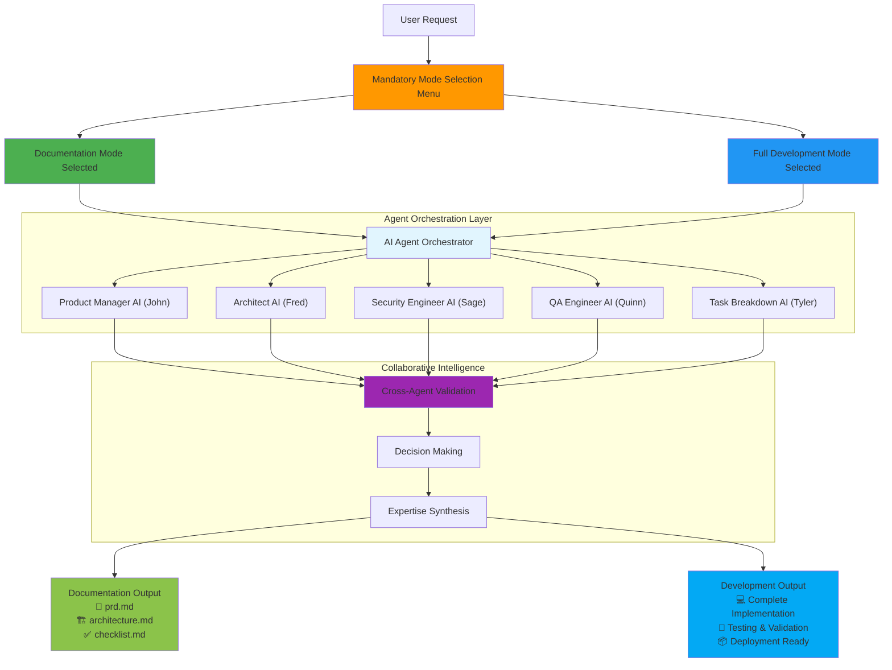
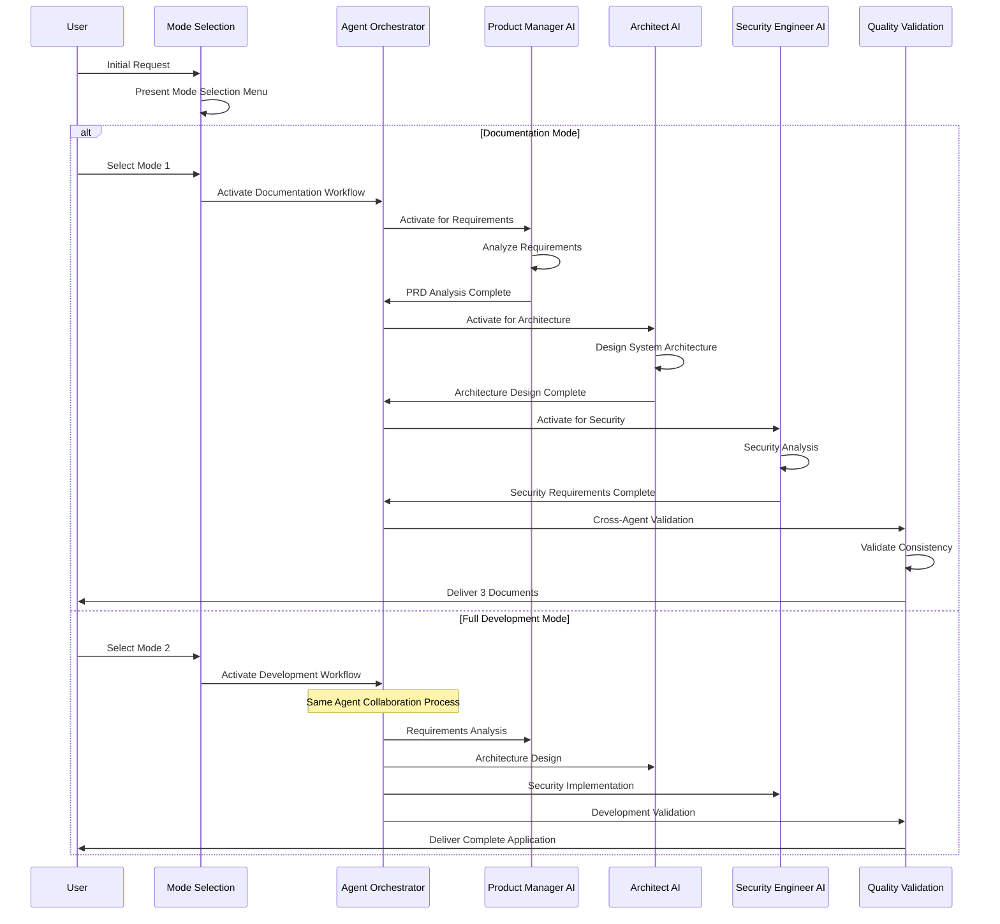

# BMAD AI Agent Orchestration System

[](https://opensource.org/licenses/MIT)
[](https://github.com/usemanusai/CodeMAD)
[](https://github.com/usemanusai/CodeMAD/issues)
[](https://github.com/usemanusai/CodeMAD/pulls)

## 🚀 Project Overview

The **BMAD (Breakthrough Method of Agile AI Agent-Driven Development)** AI Agent Orchestration System is a comprehensive platform that coordinates **15+ specialized AI agents** through intelligent workflow orchestration. The system features **mandatory mode selection** ensuring users receive exactly what they need: either professional documentation for developer handoff or complete application development.

### 🎯 Core Value Proposition

- **🎯 Mandatory Mode Selection**: Explicit choice between Documentation Mode and Full Development Mode
- **🤖 Full Agent Orchestration**: Both modes utilize complete AI agent collaboration with specialized expertise
- **📋 Collaborative Intelligence**: Cross-agent validation, decision-making, and expertise synthesis
- **⚡ Intelligent Automation**: Optimal agent selection and workflow coordination based on project requirements
- **🛡️ Quality Assurance**: Integrated validation throughout all agent workflows
- **📈 Enterprise Ready**: Scales from startup MVPs to complex enterprise projects

### 🎯 Use Cases

**Documentation Mode - Professional Handoff Documents:**
- Generate comprehensive specifications for external development teams
- Create client-ready deliverables for VS Code developers
- Produce complete PRD, architecture, and implementation documentation
- Provide detailed specifications for outsourced development

**Full Development Mode - Complete Implementation:**
- End-to-end feature development with agent quality assurance
- Enterprise-level architecture design and implementation
- Comprehensive security analysis and implementation
- Advanced data engineering and AI system creation
- Complex system migration and modernization projects

## 🎯 Mandatory Mode Selection System

Before any operations begin, users must explicitly choose between two distinct workflows that utilize the same AI agent orchestration with different output formats:

### 📋 Documentation Mode (Mode 1) - Default & Recommended

**Purpose**: Generate professional handoff documents for external development teams

**Agent Orchestration Process**:
- **🤖 Activates specialized agents**: Product Manager (John), Architect (Fred), Security Engineer (Sage), etc.
- **🔄 Collaborative intelligence**: Cross-agent validation and consensus-based decision-making
- **📋 Leverages full expertise**: Complete personas, templates, and checklists
- **📄 Professional output**: 3 comprehensive documents ready for developer handoff

**Generated Documents**:
- **`prd.md`** - Product Requirements from collaborative agent analysis
- **`architecture.md`** - Technical architecture from specialized agent design
- **`checklist.md`** - Development checklist from agent expertise synthesis

### 🚀 Full Development Mode (Mode 2)

**Purpose**: Complete application development within the chat session

**Agent Orchestration Process**:
- **🤖 Same specialized agents**: Identical agent team as Documentation Mode
- **🔄 Same collaborative intelligence**: Cross-agent validation and decision-making
- **📋 Same expertise utilization**: Complete personas, templates, and checklists
- **💻 Implementation output**: Complete application with code, testing, and deployment

### 🔑 Key Architecture Principle

**Both modes utilize identical AI agent orchestration and collaborative intelligence. Only the final deliverable format differs:**
- **Documentation Mode**: Agent collaboration → Professional handoff documents
- **Full Development Mode**: Agent collaboration → Complete application implementation

## 🚀 Quick Start Guide

### Setup (5 minutes)

1. **Copy** the contents of [agent-prompt.txt](web-build-sample/agent-prompt.txt)
2. **Paste** into Gemini Gem or ChatGPT Custom GPT 'Instructions' field
3. **Attach** remaining files from `web-build-sample/` folder as knowledge base
4. **Save** with name "BMAD AI Agent Orchestrator"

### First Experience

The system immediately presents the mandatory mode selection menu:

```
🎯 **BMAD AI Agent System - Mode Selection Required**

Please choose your workflow mode:

**1. Documentation Mode (Default & Recommended)**
   📋 Generate exactly 3 complete, final documents ready for developer handoff:
   • prd.md - Product Requirements Document
   • architecture.md - Technical architecture document
   • checklist.md - Development checklist

**2. Full Development Mode**
   🚀 Build the entire project within this chat session

**Please type "1" for Documentation Mode or "2" for Full Development Mode to continue.**
```


## 🏗️ System Architecture

### Mode Selection and Agent Orchestration Flow



### Agent Collaboration Workflow



## 🤖 Available AI Agents

The system includes specialized AI agents with defined roles and capabilities:

| Agent | Name | Specialization | Primary Output |
|-------|------|----------------|----------------|
| **Product Manager** | John | Requirements analysis, user needs | `prd.md` |
| **Architect** | Fred | Technical architecture, system design | `architecture.md` |
| **Task Breakdown Specialist** | Tyler | Implementation planning, task analysis | `checklist.md` |
| **Design Architect** | Jane | UI/UX specifications, frontend design | Frontend specs |
| **Security Engineer** | Sage | Security architecture, threat modeling | Security requirements |
| **QA Engineer** | Quinn | Testing strategy, quality assurance | Test plans |
| **Data Engineer** | Dakota | Data architecture, pipeline design | Data specifications |
| **Performance Engineer** | Phoenix | Performance optimization, monitoring | Performance plans |
| **Platform Engineer** | Alex | Infrastructure, deployment strategy | Platform specs |
| **Technical Writer** | Taylor | Documentation, knowledge transfer | Technical docs |
| **Release Manager** | River | CI/CD, deployment coordination | Release plans |
| **Product Owner** | Sarah | Validation, quality gates | Quality validation |
| **Scrum Master** | Bob | Process coordination, team facilitation | Process guidance |
| **Analyst** | Mary | Research, brainstorming, analysis | Project briefs |

### Agent Collaboration Patterns

All agents utilize collaborative intelligence through:
- **Cross-Agent Validation**: Agents review and validate each other's work
- **Consensus Decision Making**: Technology and design choices validated by multiple agents
- **Expertise Synthesis**: Specialized knowledge combined for comprehensive solutions
- **Quality Gates**: Built-in validation checkpoints throughout workflows

## 📋 Command System

The system provides comprehensive commands for workflow control and agent interaction:

### Core Commands

| Command | Description |
|---------|-------------|
| `/help` | Display available commands and workflow options |
| `/agent-list` | Show all available agents with their specializations and tasks |
| `/exit` | Return to base BMAD AI Agent Orchestrator |
| `/doc-out` | Output complete document without truncation |

### Enhanced Commands

| Command | Description |
|---------|-------------|
| `/full_yolo` | **Enhanced YOLO mode** - Activates auto-approval for all agent recommendations and decisions. Eliminates confirmation prompts while maintaining full agent orchestration. |
| `/pre_select_agents` | **Agent pre-selection interface** - Choose specific agents and tasks before workflow starts. Works with both Documentation and Development modes. |

### Agent Activation Commands

| Command | Description |
|---------|-------------|
| `/{agent}` | Switch to specific agent (e.g., `/pm`, `/architect`, `/security`) |
| `/load-{agent}` | Immediately activate specific agent with greeting |
| `/party-mode` | Group chat with all available agents for ideation |

### Usage Examples

**Enhanced YOLO Mode:**
```
User: "/full_yolo"
System: "Enhanced YOLO mode activated. All agents will assume automatic approval."
[Agents proceed with minimal user interaction while maintaining collaboration]
```

**Agent Pre-Selection:**
```
User: "/pre_select_agents"
System: [Presents organized agent selection interface]
User: [Selects Product Manager, Architect, Security Engineer]
System: "Selected agents stored for automatic activation."
```

## 📚 Documentation Mode Output Examples

When Documentation Mode is selected, agents collaborate to produce three comprehensive documents:

### 📄 prd.md - Product Requirements Document
**Agent Collaboration Results:**
- **Product Manager AI (John)**: Executive summary, user research, business requirements
- **Security Engineer AI (Sage)**: Security requirements and compliance considerations
- **Design Architect AI (Jane)**: User experience requirements and interface specifications
- **Cross-Agent Validation**: Consensus-based feature prioritization and acceptance criteria

### 🏗️ architecture.md - Technical Architecture Document
**Agent Collaboration Results:**
- **Architect AI (Fred)**: System design patterns and technology stack selection
- **Security Engineer AI (Sage)**: Security architecture and threat modeling
- **Performance Engineer AI (Phoenix)**: Scalability and performance architecture
- **Platform Engineer AI (Alex)**: Infrastructure and deployment strategy

### ✅ checklist.md - Development Checklist
**Agent Collaboration Results:**
- **Task Breakdown Specialist AI (Tyler)**: Project management and milestone planning
- **QA Engineer AI (Quinn)**: Testing strategies and quality gates
- **Security Engineer AI (Sage)**: Security implementation checkpoints
- **Platform Engineer AI (Alex)**: Deployment and infrastructure setup tasks

## 🚀 Usage Examples

### Documentation Mode Workflow
```
User: "I need project documentation for an e-commerce platform"
System: [Presents mode selection menu]
User: "1" (Documentation Mode)

Agent Orchestration Process:
1. Product Manager AI (John) - Requirements analysis and user research
2. Architect AI (Fred) - Technical architecture and system design
3. Security Engineer AI (Sage) - Security requirements and threat modeling
4. Cross-agent validation and consensus building
5. Quality validation and document finalization

Result: 3 comprehensive documents ready for developer handoff
```

### Full Development Mode Workflow
```
User: "I want to build a complete e-commerce platform"
System: [Presents mode selection menu]
User: "2" (Full Development Mode)

Agent Orchestration Process:
1. Same agent collaboration as Documentation Mode
2. Additional development agents for implementation
3. Code generation, testing, and deployment
4. Cross-agent validation throughout development
5. Quality assurance and final delivery

Result: Complete application with full implementation
```

## 🔧 System Configuration

The system uses configuration files to define agent capabilities and workflows:

- **[agent-config.txt](web-build-sample/agent-config.txt)** - Complete agent roster and specializations
- **[personas.txt](web-build-sample/personas.txt)** - Detailed agent personality definitions
- **[tasks.txt](web-build-sample/tasks.txt)** - Comprehensive task library for agent execution
- **[templates.txt](web-build-sample/templates.txt)** - Standardized templates for deliverable creation
- **[checklists.txt](web-build-sample/checklists.txt)** - Quality validation checklists for workflows

## ✨ Key Features

### 🧠 Intelligent Agent Selection
- **Multi-Criteria Algorithm**: Optimal agent selection based on expertise match and project requirements
- **Collaboration History**: Leverages past successful agent team combinations
- **Context Awareness**: Adapts selection based on project requirements and constraints

### 🔄 Agent Workflow Orchestration
- **Dynamic Task Sequencing**: Optimizes task order for efficiency and dependencies
- **Parallel Execution**: Maximizes throughput through intelligent agent coordination
- **Quality Gate Integration**: Embedded validation checkpoints throughout workflows
- **Cross-Agent Validation**: Agents review and validate each other's work

### 🛡️ Quality Assurance Integration
- **Built-in Quality Gates**: Comprehensive validation with specialized agents
- **Multi-Layer Validation**: Security, performance, and quality checks
- **Consensus Decision Making**: Technology choices validated by multiple agent perspectives

## 📚 Additional Documentation

### Extended Documentation
- **[Original BMAD Method](docs/readme.md)** - Original method documentation and IDE specifics
- **[Contributing Guidelines](docs/CONTRIBUTING.md)** - How to contribute to the system
- **[Implementation Summary](IMPLEMENTATION_SUMMARY.md)** - Technical implementation details
- **[Critical Bug Fix Summary](CRITICAL_BUG_FIX_SUMMARY.md)** - Architecture corrections documentation

## 🤝 Contributing

We welcome contributions to enhance the BMAD AI Agent Orchestration System:

### How to Contribute
1. **Fork the repository** and create a feature branch
2. **Implement enhancements** following established patterns
3. **Test with AI assistants** (ChatGPT, Gemini) to validate functionality
4. **Create pull request** with detailed description of changes
5. **Community review** and integration testing

### Areas for Contribution
- **New Agent Personas**: Add specialized agents with defined capabilities
- **Task Optimization**: Improve task specifications for better execution
- **Template Development**: Create standardized templates for new deliverable types
- **Quality Assurance**: Develop comprehensive validation checklists

---

## 🚀 Get Started

**Ready to experience intelligent AI agent orchestration?**

1. Navigate to `web-build-sample/` directory
2. Copy `agent-prompt.txt` contents into your AI assistant
3. Attach remaining files as knowledge base
4. Experience the mandatory mode selection system
5. Choose Documentation Mode for handoff documents or Full Development Mode for complete implementation

**Links**: [Join Community](https://github.com/usemanusai/CodeMAD/discussions) | [Report Issues](https://github.com/usemanusai/CodeMAD/issues) | [View Documentation](docs/readme.md)
