# BMAD AI Agent Orchestration System

[](https://opensource.org/licenses/MIT)
[](https://github.com/usemanusai/CodeMAD)
[](https://github.com/usemanusai/CodeMAD/issues)
[](https://github.com/usemanusai/CodeMAD/pulls)

## 🚀 Project Overview

The **BMAD (Breakthrough Method of Agile AI Agent-Driven Development)** AI Agent Orchestration System is a comprehensive, intelligent platform that coordinates **50+ specialized software development AI agents** to handle virtually any software development scenario. The system now features **mandatory mode selection** to ensure users get exactly what they need: either comprehensive documentation for developer handoff or complete application development within the chat session.

### 🎯 Key Benefits

- **🎯 Mandatory Mode Selection**: Forces explicit choice between Documentation Mode (handoff documents) and Full Development Mode (complete implementation)
- **📋 Documentation Mode**: Generates exactly 3 complete, standalone documents (prd.md, architecture.md, checklist.md) ready for developer handoff
- **🚀 Full Development Mode**: Complete application development with intelligent AI agent coordination and workflow optimization
- **🤖 Intelligent AI Agent Automation**: Automatically selects optimal AI agents and coordinates workflows based on project requirements and selected mode
- **⚡ 50% Productivity Increase**: Streamlines development processes through specialized AI agent expertise and parallel execution
- **🛡️ Quality Assurance**: Integrated quality gates and validation throughout all AI agent workflows
- **📈 Scalable Architecture**: Enterprise-ready system that scales from startup MVPs to complex enterprise projects
- **🔄 Adaptive Learning**: Continuously improves AI agent workflow efficiency based on outcomes and feedback

### 👥 Target Audience

- **Software Development Teams** seeking intelligent AI agent workflow automation
- **Engineering Managers** looking to optimize team productivity through AI agent coordination
- **Enterprise Organizations** requiring comprehensive development process orchestration via AI agents
- **Startups** needing rapid, high-quality software development capabilities through AI agent collaboration
- **DevOps Teams** implementing advanced CI/CD and automation strategies with AI agent support

### 🎯 Use Cases

**Documentation Mode (Perfect for Client/Team Handoffs):**
- **Project Specification**: Generate comprehensive documentation for external development teams
- **Client Deliverables**: Create professional handoff documents for VS Code developers
- **Requirement Documentation**: Complete PRD, architecture, and implementation checklists
- **Vendor Coordination**: Provide detailed specifications for outsourced development

**Full Development Mode (Complete Implementation):**
- **Feature Development**: End-to-end feature implementation with AI agent quality assurance
- **System Architecture**: Enterprise-level architecture design and implementation via specialized AI agents
- **Security Implementation**: Comprehensive security analysis and implementation through AI agent coordination
- **Data Platform Development**: Advanced data engineering and AI system creation using specialized AI agents
- **Legacy Modernization**: Complex system migration and modernization projects with AI agent expertise

## 🎯 Mandatory Mode Selection System

The BMAD Method 3.1 features a **mandatory mode selection system** that ensures users get exactly what they need. Before any AI agent operations begin, users must explicitly choose between two distinct workflows:

### 📋 Documentation Mode (Mode 1) - Default & Recommended
**Perfect for:** Sending specifications to developers working in VS Code Insiders

**Full AI Agent Orchestration → Professional Documents:**
- **🤖 Activates specialized AI agents** (Product Manager, Architect, Security Engineer, etc.)
- **🔄 Collaborative intelligence** with cross-agent validation and decision-making
- **📋 Leverages agent expertise** using personas, templates, and checklists
- **📄 Formats output as 3 complete documents** ready for developer handoff

**Generated Documents:**
- **`prd.md`** - Product Requirements from collaborative agent analysis
- **`architecture.md`** - Technical architecture from specialized agent design
- **`checklist.md`** - Development checklist from agent expertise synthesis

**Key Features:**
- ✅ **Full agent collaboration** with specialized expertise
- ✅ **Collaborative intelligence** applied to document creation
- ✅ **Professional quality** ready for client/team handoff
- ✅ **Standalone documents** requiring no additional clarification
- ✅ **No actual development** - agents focus on specification and planning

### 🚀 Full Development Mode (Mode 2)
**Perfect for:** Complete application development within the chat session

**Full AI Agent Orchestration → Complete Implementation:**
- **🤖 Activates specialized AI agents** (same agents as Documentation Mode)
- **🔄 Collaborative intelligence** with cross-agent validation and decision-making
- **📋 Leverages agent expertise** using personas, templates, and checklists
- **💻 Implements complete application** with full code, testing, and deployment

**Key Features:**
- ✅ **Full agent collaboration** with specialized expertise
- ✅ **Complete implementation** with code, testing, and deployment
- ✅ **Interactive development workflow** with real-time agent coordination
- ✅ **50+ specialized AI agents** available for comprehensive development

### Key System Enhancements (Latest Update)

- **Mandatory Mode Selection**: Users must explicitly choose their workflow before proceeding
- **Full Agent Orchestration in Both Modes**: Both Documentation and Development modes utilize complete AI agent collaboration
- **Collaborative Intelligence Preserved**: All modes leverage specialized agent expertise, personas, templates, and checklists
- **Output Format Differentiation**: Only the final deliverable format differs between modes (documents vs. implementation)
- **AI Agent Self-Perception**: System correctly identifies as coordinating "AI agents" rather than "human workers"
- **Enhanced Agent Collaboration**: Cross-agent validation, decision-making, and expertise synthesis in all workflows
- **Mode-Based Routing**: Intelligent workflow routing based on user selection while maintaining agent orchestration
- **AI Agent Optimization**: Tasks sized and structured specifically for AI agent context windows and capabilities

## 🚀 Quick Start - Try the Mode Selection System

The fastest way to understand the BMAD system is to experience the new mode selection workflow! Set up takes just a few minutes in Gemini or ChatGPT.

### Web Quickstart Project Setup (Recommended)

AI Agent Orchestrator with **mandatory mode selection** - already pre-compiled in the `web-build-sample` folder.

**Setup Steps:**
1. **Copy** the contents of [Agent Prompt Sample](web-build-sample/agent-prompt.txt)
2. **Paste** into Gemini Gem or ChatGPT Custom GPT 'Instructions' field
3. **Attach** the remaining files from `web-build-sample/` folder as knowledge base
4. **Save** with a name like "BMAD AI Agent Orchestrator"

**First Experience:**
- The system will **immediately present the mode selection menu**
- Choose **Mode 1 (Documentation)** to generate handoff documents
- Choose **Mode 2 (Development)** for full application development
- Start with `/help` to explore all capabilities


### Mode Selection Menu Preview

When you first interact with the system, you'll see:

```
🎯 **BMAD AI Agent System - Mode Selection Required**

Please choose your workflow mode:

**1. Documentation Mode (Default & Recommended)**
   📋 Generate exactly 3 complete, final documents ready for developer handoff:
   • prd.md - Product Requirements Document
   • architecture.md - Technical architecture document
   • checklist.md - Development checklist

**2. Full Development Mode**
   🚀 Build the entire project within this chat session

**Please type "1" for Documentation Mode or "2" for Full Development Mode to continue.**
```

## 🏗️ System Architecture

### Mode Selection System Architecture

```mermaid
graph TB
    subgraph "BMAD AI Agent Orchestration System with Mode Selection"
        U[User Request] --> MS[Mandatory Mode Selection Menu]

        MS --> DM[Documentation Mode Selected]
        MS --> FM[Full Development Mode Selected]

        subgraph "Documentation Mode Workflow"
            DM --> DW[AI Agent Orchestrator<br/>Documentation Mode]
            DW --> DPM[Product Manager AI - John<br/>🧠 Full Persona & Expertise]
            DW --> DAR[Architect AI - Fred<br/>🏗️ Full Technical Analysis]
            DW --> DTB[Task Breakdown AI - Tyler<br/>📋 Complete Planning]
            DW --> DSE[Security Engineer AI - Sage<br/>🔒 Security Analysis]
            DW --> DDE[Design Architect AI - Jane<br/>🎨 UX/UI Expertise]

            DPM --> DPRD[Collaborative PRD Analysis]
            DAR --> DARCH[Collaborative Architecture Design]
            DTB --> DTASKS[Collaborative Implementation Planning]
            DSE --> DSEC[Security Requirements]
            DDE --> DUI[UI/UX Specifications]

            DPRD --> DD[Documentation Deliverables<br/>📄 prd.md<br/>🏗️ architecture.md<br/>✅ checklist.md]
            DARCH --> DD
            DTASKS --> DD
            DSEC --> DD
            DUI --> DD
        end

        subgraph "Full Development Mode Workflow"
            FM --> FO[AI Agent Orchestrator<br/>Full Development Mode]

            subgraph "AI Agent Categories - Same Agents, Different Output"
                FCD[Core Development AI Agents<br/>👨‍💻 12 AI Agents<br/>Frontend, Backend, Mobile<br/>API, Database, Blockchain]
                FIO[Infrastructure & Operations AI Agents<br/>⚙️ 10 AI Agents<br/>DevOps, SRE, Cloud<br/>Kubernetes, Monitoring]
                FSC[Security & Compliance AI Agents<br/>🔒 8 AI Agents<br/>Security, Cybersecurity<br/>Compliance, Privacy]
                FDA[Data & AI Agents<br/>🤖 8 AI Agents<br/>Data Engineering, ML<br/>AI, Analytics]
                FQT[Quality & Testing AI Agents<br/>✅ 6 AI Agents<br/>QA, Automation<br/>Performance, Accessibility]
                FST[Specialized Technical AI Agents<br/>🎯 6 AI Agents<br/>Architecture, Integration<br/>Migration, Research]
            end

            FO --> FCD
            FO --> FIO
            FO --> FSC
            FO --> FDA
            FO --> FQT
            FO --> FST

            FCD --> FD[Full Development Deliverables<br/>💻 Complete Implementation<br/>🧪 Testing & Validation<br/>📦 Deployment Ready]
            FIO --> FD
            FSC --> FD
            FDA --> FD
            FQT --> FD
            FST --> FD
        end

        subgraph "Supporting Systems"
            KB[Knowledge Base<br/>📚 Templates & Checklists<br/>📋 Best Practices<br/>📖 Documentation]
            QF[Quality Framework<br/>🎯 Quality Gates<br/>✅ Validation Rules<br/>📊 Metrics & KPIs]
            WE[Workflow Engine<br/>🔄 Task Orchestration<br/>⚡ Parallel Execution<br/>🔗 Dependency Management]
        end

        DW --> KB
        O --> KB
        DW --> QF
        O --> QF
        DW --> WE
        O --> WE
    end

    style MS fill:#ff9800
    style DM fill:#4caf50
    style FM fill:#2196f3
    style DD fill:#8bc34a
    style FD fill:#03a9f4
    style O fill:#e1f5fe
    style CD fill:#f3e5f5
    style IO fill:#e8f5e8
    style SC fill:#fff3e0
    style DA fill:#e3f2fd
    style QT fill:#f1f8e9
    style ST fill:#fce4ec
```



### Mode Selection Workflow Process

```mermaid
sequenceDiagram
    participant U as User
    participant MS as Mode Selection System
    participant DW as Documentation Workflow
    participant PM as Product Manager AI
    participant AR as Architect AI
    participant TB as Task Breakdown AI
    participant O as AI Agent Orchestrator
    participant AG as AI Agent Team
    participant QG as Quality Gates

    U->>MS: Initial Request
    MS->>MS: Present Mode Selection Menu
    Note over MS: 🎯 Mandatory Choice Required<br/>📋 Mode 1: Documentation<br/>🚀 Mode 2: Full Development

    alt Documentation Mode Selected
        U->>MS: Select Mode 1 (Documentation)
        MS->>DW: Activate Documentation Workflow

        DW->>PM: Generate PRD
        PM->>PM: Create prd.md
        PM->>DW: Complete Product Requirements

        DW->>AR: Generate Architecture
        AR->>AR: Create architecture.md
        AR->>DW: Complete Technical Architecture

        DW->>TB: Generate Checklist
        TB->>TB: Create checklist.md
        TB->>DW: Complete Development Checklist

        DW->>QG: Validate Documentation
        QG->>QG: Quality Check
        Note over QG: ✅ Completeness Check<br/>📋 Consistency Validation<br/>🎯 Handoff Readiness

        QG->>U: Deliver 3 Complete Documents
        Note over U: 📄 prd.md<br/>🏗️ architecture.md<br/>✅ checklist.md

    else Full Development Mode Selected
        U->>MS: Select Mode 2 (Full Development)
        MS->>O: Activate AI Agent Orchestrator

        O->>O: AI Agent Selection & Coordination
        Note over O: 🧠 Analyze Request<br/>🎯 Select Optimal AI Agents<br/>🔄 Coordinate Workflows

        O->>AG: Deploy AI Agent Team
        AG->>AG: Parallel Development Execution

        AG->>QG: Submit Development Deliverables
        QG->>QG: Comprehensive Quality Validation
        Note over QG: ✅ Code Review<br/>🔒 Security Check<br/>⚡ Performance Test

        QG->>U: Deliver Complete Application
        Note over U: 🚀 Full Implementation<br/>🧪 Tested & Validated<br/>📦 Ready for Deployment
    end

    Note over MS,U: 🎯 Mode Selection Ensures<br/>Appropriate Output for User Needs
```



## Mode-Based AI Agent Coordination

The BMAD Method 3.1 features two distinct AI agent coordination workflows based on mandatory mode selection:

### Documentation Mode Workflow - Full Agent Orchestration

```mermaid
graph TD
    A[User Request] --> MS[Mandatory Mode Selection]
    MS --> DM[Documentation Mode Selected]

    DM --> B[BMad AI Agent Orchestrator]
    B --> AS[Agent Selection & Activation<br/>🧠 Analyze Project Requirements<br/>🎯 Select Specialized Agents<br/>🔄 Coordinate Collaboration]

    AS --> PM[Product Manager AI - John<br/>📋 Full Persona & Expertise<br/>🔍 Requirements Analysis<br/>👥 User Research]
    AS --> AR[Architect AI - Fred<br/>🏗️ Technical Architecture<br/>⚙️ Technology Selection<br/>🔒 Security Design]
    AS --> TB[Task Breakdown AI - Tyler<br/>✅ Implementation Planning<br/>📊 Project Management<br/>🎯 Milestone Definition]
    AS --> SE[Security Engineer AI - Sage<br/>🔒 Security Analysis<br/>🛡️ Threat Modeling<br/>📋 Compliance Review]
    AS --> DA[Design Architect AI - Jane<br/>🎨 UI/UX Design<br/>📱 User Experience<br/>🖼️ Interface Specifications]

    PM --> COLLAB[Agent Collaboration Hub<br/>🤝 Cross-Agent Validation<br/>🔄 Iterative Refinement<br/>📊 Decision Synthesis]
    AR --> COLLAB
    TB --> COLLAB
    SE --> COLLAB
    DA --> COLLAB

    COLLAB --> PRD[prd.md<br/>Collaborative Product Requirements<br/>• Agent-Validated User Stories<br/>• Cross-Referenced Technical Constraints<br/>• Consensus-Based Success Metrics]

    COLLAB --> ARCH[architecture.md<br/>Collaborative Technical Architecture<br/>• Multi-Agent System Design<br/>• Validated Technology Stack<br/>• Integrated Security & Performance]

    COLLAB --> CHECK[checklist.md<br/>Collaborative Development Checklist<br/>• Agent-Optimized Implementation Phases<br/>• Cross-Validated Quality Gates<br/>• Comprehensive Testing Strategy]

    PRD --> QV[Quality Validation by Product Owner AI<br/>📊 Completeness Check<br/>🔗 Cross-Reference Validation<br/>🎯 Handoff Readiness<br/>✅ Agent Consensus Verification]
    ARCH --> QV
    CHECK --> QV

    QV --> DD[Documentation Deliverables<br/>🤖 Agent-Collaborated Documents<br/>📋 Professional Quality<br/>🎯 Ready for Developer Handoff]

    style MS fill:#ff9800
    style DM fill:#4caf50
    style B fill:#e1f5fe
    style AS fill:#2196f3
    style COLLAB fill:#9c27b0
    style PM fill:#f3e5f5
    style AR fill:#e8f5e8
    style TB fill:#fff3e0
    style SE fill:#ffeb3b
    style DA fill:#fce4ec
    style DD fill:#8bc34a
```



### Full Development Mode Workflow


## Documentation Mode: Three-Document Creation Process

When Documentation Mode is selected, the system follows a sequential AI agent handoff process to create three comprehensive, standalone documents ready for developer handoff:


### Documentation Mode Output Examples - Agent Collaboration Results

**📄 prd.md - Product Requirements Document (Agent-Collaborated)**
- **Product Manager AI (John)**: Executive summary, user research, and business requirements
- **Security Engineer AI (Sage)**: Security requirements and compliance considerations
- **Design Architect AI (Jane)**: User experience requirements and interface specifications
- **Cross-Agent Validation**: Consensus-based feature prioritization and acceptance criteria
- **Collaborative Output**: Complete functional and non-functional requirements with agent expertise

**🏗️ architecture.md - Technical Architecture Document (Agent-Collaborated)**
- **Architect AI (Fred)**: System design patterns and technology stack selection
- **Security Engineer AI (Sage)**: Security architecture and threat modeling
- **Performance Engineer AI (Phoenix)**: Scalability and performance architecture
- **Platform Engineer AI (Alex)**: Infrastructure and deployment strategy
- **Cross-Agent Validation**: Technology choices validated by multiple specialist perspectives
- **Collaborative Output**: Comprehensive technical architecture with multi-agent expertise

**✅ checklist.md - Development Checklist (Agent-Collaborated)**
- **Task Breakdown Specialist AI (Tyler)**: Project management and milestone planning
- **QA Engineer AI (Quinn)**: Testing strategies and quality gates
- **Security Engineer AI (Sage)**: Security implementation checkpoints
- **Platform Engineer AI (Alex)**: Deployment and infrastructure setup tasks
- **Cross-Agent Validation**: Implementation phases optimized by specialist expertise
- **Collaborative Output**: Comprehensive development roadmap with agent-validated tasks

### Multi-Agent Collaboration Patterns


## AI Agent Interaction Patterns

The updated system features enhanced AI agent coordination with clear specialization and handoff protocols:


## Available AI Agents

The system includes the following specialized AI agents:

| AI Agent | Name | Specialization | Primary Deliverable |
|----------|------|----------------|-------------------|
| **Product Manager** | John | PRD creation, user needs analysis | `prd.md` |
| **Architect** | Fred | Technical architecture, system design | `architecture.md` |
| **Task Breakdown Specialist** | Tyler | Comprehensive task analysis & breakdown | `tasks.md` |
| **Design Architect** | Jane | UI/UX specifications, frontend architecture | Frontend specs |
| **Analyst** | Mary | Research, brainstorming, requirements gathering | Project briefs |
| **Product Owner** | Sarah | Validation, quality assurance, change management | Quality validation |

## 🚀 Getting Started with Mode Selection System

### Quick Setup (Recommended)

The BMAD AI Agent Orchestration System is designed to work with AI assistants like ChatGPT or Google Gemini. No traditional software installation required!

#### Web Agent Setup (5 minutes)

1. **Navigate to** the `web-build-sample/` directory in this repository
2. **Copy the contents** of `agent-prompt.txt`
3. **Paste into your AI assistant** (ChatGPT Custom GPT or Google Gemini Gem instructions field)
4. **Attach the remaining files** from the `web-build-sample/` folder as knowledge base files
5. **Save your AI agent** with a name like "BMAD AI Agent Orchestrator"
6. **Experience the mode selection** - the system will immediately present the mode selection menu

#### Mode Selection Experience

Once your AI agent orchestrator is set up, every interaction begins with mode selection:

**For Documentation Handoff (Recommended for most users):**
```
Request: "I need complete project documentation for a new e-commerce platform"

System Response: [Mode Selection Menu]
Your Choice: "1" (Documentation Mode)

AI Agent Orchestrator will:
1. Analyze project requirements and select specialized agents
2. Activate Product Manager AI (John) with full persona and expertise
3. Activate Architect AI (Fred) for technical design and analysis
4. Activate Security Engineer AI (Sage) for security requirements
5. Activate Design Architect AI (Jane) for UI/UX specifications
6. Coordinate agent collaboration with cross-validation and consensus
7. Format collaborative intelligence as 3 professional handoff documents

Result: 3 agent-collaborated, comprehensive documents ready for developer handoff
```

**For Full Development (Complete implementation):**
```
Request: "I want to build a complete e-commerce platform"

System Response: [Mode Selection Menu]
Your Choice: "2" (Full Development Mode)

AI Agent Orchestrator will:
1. Analyze project requirements and select specialized agents (same as Documentation Mode)
2. Activate Product Manager AI, Architect AI, Security Engineer AI, etc. with full personas
3. Coordinate agent collaboration for requirements, architecture, and planning
4. Activate Development AI agents for implementation (Frontend, Backend, Database, etc.)
5. Execute cross-agent validation, testing, and quality assurance
6. Deliver complete application with full implementation and deployment

Result: Complete application with full agent collaboration and implementation
```

#### Mode Selection Commands

After setup, you can also use direct commands:

```
/help - View all available commands and mode options
/agent-list - See all 50+ available AI agents (Full Development Mode)
1 or "Documentation Mode" - Generate handoff documents
2 or "Full Development Mode" - Build complete application
```

### AI Agent Coordination Configuration

The system uses configuration files to define AI agent capabilities and workflows:

- **`agent-config.txt`** - Defines all available AI agents and their specializations
- **`personas.txt`** - Contains detailed AI agent personality and capability definitions
- **`tasks.txt`** - Comprehensive task library for AI agent execution
- **`templates.txt`** - Standardized templates for deliverable creation
- **`checklists.txt`** - Quality validation checklists for AI agent workflows

## 🤖 AI Agent Categories Overview

### 🔧 Core Development (12 AI Agents)
Comprehensive application development coverage including frontend, backend, full-stack, mobile, web, API, database, microservices, game, embedded, desktop, and blockchain development AI specialists.

### ⚙️ Infrastructure & Operations (10 AI Agents)
Complete operational excellence with DevOps, SRE, platform, cloud, infrastructure, Kubernetes, network, systems administration, monitoring, and deployment AI specialists.

### 🔒 Security & Compliance (8 AI Agents)
Full security and regulatory coverage including security engineers, cybersecurity analysts, penetration testers, compliance officers, privacy engineers, identity engineers, cryptography engineers, and security architect AI specialists.

### 🤖 Data & AI (8 AI Agents)
Modern data and AI capabilities with data engineers, data scientists, ML engineers, AI engineers, data analysts, database administrators, big data engineers, and MLOps engineer AI specialists.

### ✅ Quality & Testing (6 AI Agents)
Comprehensive quality assurance including QA engineers, test automation engineers, performance engineers, accessibility engineers, usability engineers, and QA manager AI specialists.

### 🎯 Specialized Technical (6 AI Agents)
Advanced technical expertise with solutions architects, technical leads, integration engineers, migration engineers, optimization engineers, and research engineer AI specialists.

**Total System Capacity:**
- **50+ Specialized AI Agents** across all domains
- **200+ Granular Tasks** with detailed specifications
- **Intelligent AI Agent Orchestration** with adaptive learning
- **Enterprise-Ready** scalability and reliability

[More Documentation, Explanations, and IDE Specifics](docs/readme.md) available here!

## ✨ Key Features

### 🧠 Intelligent AI Agent Selection
- **Multi-Criteria Algorithm**: 40% expertise match, 20% secondary skills, 15% experience level
- **Workload Balancing**: Considers AI agent availability and capacity
- **Collaboration History**: Leverages past successful AI agent team combinations
- **Context Awareness**: Adapts selection based on project requirements and constraints

### 🔄 AI Agent Workflow Orchestration
- **Dynamic Task Sequencing**: Optimizes task order for efficiency and dependencies
- **Parallel Execution**: Maximizes throughput through intelligent AI agent parallelization
- **Quality Gate Integration**: Embedded validation checkpoints throughout AI agent workflows
- **Adaptive Learning**: Continuously improves based on AI agent outcome analysis

### 🛡️ Quality Assurance Integration
- **Built-in Quality Gates**: Code review, security scan, performance testing
- **Comprehensive Validation**: Multi-layer validation with specialized AI agents
- **Metrics and KPIs**: Quality metrics tracking and continuous improvement
- **Risk Mitigation**: Proactive risk identification and mitigation strategies

### 📈 Enterprise Readiness
- **Scalable Architecture**: Handles projects from MVP to enterprise scale
- **Security First**: Comprehensive security integration throughout all AI agent workflows
- **Compliance Support**: Built-in compliance validation and audit trails
- **Integration Capabilities**: Seamless integration with existing development tools

## 📚 AI Agent Orchestration Documentation

### Core AI Agent System Files
Essential files for understanding and configuring the AI agent orchestration system:

- **[AI Agent Configuration](web-build-sample/agent-config.txt)** - Complete AI agent roster and capabilities
- **[AI Agent Personas](web-build-sample/personas.txt)** - Detailed AI agent personality definitions
- **[Task Library](web-build-sample/tasks.txt)** - Comprehensive task specifications for AI agents
- **[Templates](web-build-sample/templates.txt)** - Standardized templates for deliverable creation
- **[Quality Checklists](web-build-sample/checklists.txt)** - Validation frameworks for AI agent workflows

### AI Agent Orchestration Guides
- **[Comprehensive Deliverable Workflow](codemad-agent/comprehensive-deliverable-workflow.md)** - Complete guide to three-deliverable creation process
- **[AI Agent Orchestration Correction Summary](AI_AGENT_ORCHESTRATION_CORRECTION_SUMMARY.md)** - Details of system corrections and enhancements

### Individual AI Agent Documentation
- **[AI Agent Personas](codemad-agent/personas/)** - Individual AI agent personalities and capabilities
- **[Task Specifications](codemad-agent/tasks/)** - Detailed task requirements and deliverables
- **[Templates](codemad-agent/templates/)** - Standardized documentation templates
- **[Checklists](codemad-agent/checklists/)** - Quality validation checklists

### Setup and Configuration
- **[Web Build Sample](web-build-sample/)** - Complete AI agent orchestrator setup files
- **[Original BMAD Method](docs/readme.md)** - Original method documentation and IDE specifics
- **[Contributing Guidelines](docs/CONTRIBUTING.md)** - How to contribute to the AI agent system

## 🤝 Contributing to AI Agent Orchestration

We welcome contributions to the BMAD AI Agent Orchestration System! Here's how you can help enhance our AI agent capabilities:

### Adding New AI Agents

1. **Create AI Agent Persona**
   - Define AI agent personality, expertise, and communication style
   - Add to `codemad-agent/personas/new-agent-name.md`
   - Include specialization areas and confidence levels

2. **Define AI Agent Capabilities**
   - Specify core technologies and expertise domains
   - Define collaboration patterns with other AI agents
   - List primary deliverables and output formats

3. **Create AI Agent Tasks**
   - Develop 4-8 specialized tasks for the AI agent
   - Add to `codemad-agent/tasks/` directory
   - Ensure tasks are optimized for AI agent context windows

4. **Update Configuration Files**
   - Add AI agent to `web-build-sample/agent-config.txt`
   - Update `web-build-sample/personas.txt` with full persona definition
   - Add tasks to `web-build-sample/tasks.txt`

### Enhancing AI Agent Workflows

1. **Task Optimization**
   - Improve task specifications for better AI agent execution
   - Add quality gates and validation checkpoints
   - Optimize for AI agent context window limitations

2. **Template Development**
   - Create standardized templates for new deliverable types
   - Add to `web-build-sample/templates.txt`
   - Ensure templates support AI agent workflow patterns

3. **Quality Assurance**
   - Develop comprehensive checklists for AI agent validation
   - Add to `web-build-sample/checklists.txt`
   - Include AI agent-specific quality criteria

### AI Agent System Standards

- **Documentation**: All AI agents must include comprehensive persona definitions and task specifications
- **Quality Gates**: Include validation checkpoints optimized for AI agent workflows
- **Testing**: Validate AI agent personas through pilot implementations with real AI assistants
- **Consistency**: Follow established patterns for AI agent coordination and handoffs

### Review Process for AI Agent Enhancements

1. **Fork the repository** and create a feature branch
2. **Implement AI agent enhancements** following the contribution guidelines
3. **Test with AI assistants** (ChatGPT, Gemini) to validate functionality
4. **Create pull request** with detailed description of AI agent capabilities
5. **Community review** of AI agent design and implementation
6. **Integration testing** with existing AI agent orchestration system

### Getting Help with AI Agent Development

- **GitHub Issues**: Report AI agent bugs or request new AI agent capabilities
- **Discussions**: Join community discussions about AI agent design patterns
- **Documentation**: Refer to AI agent orchestration guides and examples
- **Community**: Connect with other AI agent developers and users

## 📊 AI Agent Orchestration Success Metrics

### Expected AI Agent Coordination Outcomes
- **Comprehensive Documentation Delivery** - Complete prd.md, architecture.md, and tasks.md creation
- **AI Agent Workflow Efficiency** - Optimized task handoffs between specialized AI agents
- **Quality Assurance Integration** - Built-in validation throughout AI agent collaboration
- **Context Window Optimization** - Tasks sized appropriately for AI agent capabilities
- **Consistent AI Agent Performance** - Reliable deliverable quality across all AI agent types

### AI Agent System Performance Targets
- **Immediate AI Agent Activation** - Instant persona switching and task assignment
- **100% AI Agent Capability Coverage** - All project requirements addressable by available AI agents
- **Comprehensive Deliverable Quality** - Complete, actionable documentation from AI agent collaboration
- **User Satisfaction with AI Agent Coordination** - Effective orchestration and clear AI agent specialization

## 🚀 Quick Start with Mode Selection System

For immediate hands-on experience with the new mode selection system:

1. **Navigate to** `web-build-sample/` directory
2. **Copy contents** of `agent-prompt.txt` into your AI assistant (Gemini or ChatGPT) custom instructions
3. **Attach remaining files** (`agent-config.txt`, `personas.txt`, `tasks.txt`, `templates.txt`, `checklists.txt`) as knowledge base
4. **Experience mode selection** - the system will immediately present the mandatory mode selection menu
5. **Try Documentation Mode (1)** to generate 3 complete handoff documents (prd.md, architecture.md, checklist.md)
6. **Try Full Development Mode (2)** to access 50+ specialized AI agents for complete application development
7. **Use** `/help` command to explore all capabilities after mode selection

**Key Benefits:**
- **Full agent orchestration in both modes** - collaborative intelligence always preserved
- **Same specialized agents, different output format** - Documentation vs. Implementation
- **Perfect for AI platforms** like Gemini Gems where you want agent-collaborated documentation
- **Professional handoff documents** with multi-agent expertise ready for VS Code developers
- **Complete development option** with same agent collaboration for full implementation

This provides instant access to full AI agent orchestration capabilities with explicit user control over the output format while maintaining collaborative intelligence in all workflows.

---

**Ready to experience intelligent AI agent orchestration for your projects?** 🤖

[Get Started with AI Agents](#-getting-started-with-ai-agent-orchestration) | [View AI Agent Documentation](#-ai-agent-orchestration-documentation) | [Join Community](https://github.com/usemanusai/CodeMAD/discussions) | [Report Issues](https://github.com/usemanusai/CodeMAD/issues)
