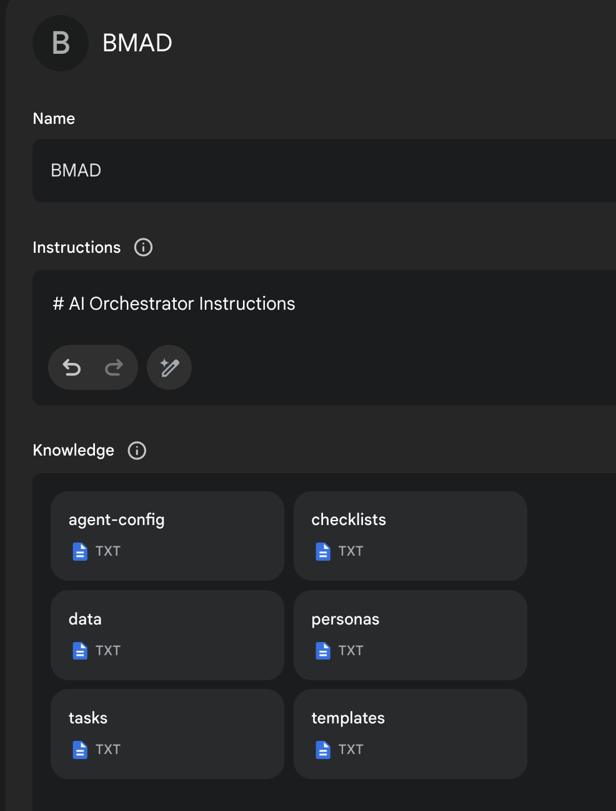

# The BMAD-Method 3.1 (Breakthrough Method of Agile AI Agent-Driven Development)

Old Versions:
[Prior Version 1](https://github.com/bmadcode/BMAD-METHOD/tree/V1)
[Prior Version 2](https://github.com/bmadcode/BMAD-METHOD/tree/V2)

## AI Agent Orchestration System

The BMAD Method 3.1 features a comprehensive **AI Agent Orchestration System** that coordinates multiple specialized AI agents working collaboratively toward specific deliverable goals. The system has been enhanced to properly understand that it coordinates AI agents (not human workers) and delivers three comprehensive documentation files through coordinated AI agent collaboration.

### Key System Corrections (Latest Update)

- **AI Agent Self-Perception**: System now correctly identifies as coordinating "AI agents" rather than "human workers"
- **Comprehensive Task Breakdown**: Added new Task Breakdown Specialist AI Agent (Tyler) for creating detailed `tasks.md` deliverables
- **Three-Deliverable Workflow**: Complete workflow for `prd.md`, `architecture.md`, and `tasks.md` creation
- **AI Agent Optimization**: Tasks sized and structured specifically for AI agent context windows and capabilities

## Do This First, and all will make sense

There are lots of docs here, but I HIGHLY suggest you just try the Web Agent - it takes just a few minutes to set up in Gemini - and you can use the BMad AI Agent Orchestrator to explain how this method works, how to set up in the IDE, how to set up in the Web, what should be done in the web or ide (although you can choose your own path also!) - all just by talking to the bmad AI agent orchestrator!

### Web Quickstart Project Setup (Recommended)

AI Agent Orchestrator that coordinates multiple specialized AI agents - already pre-compiled in the `web-build-sample` folder.

- The contents of [Agent Prompt Sample](web-build-sample/agent-prompt.txt) text get pasted into the Gemini Gem, or ChatGPT customGPT 'Instructions' field.
- The remaining files in that same folder just need to be attached as shown in the screenshot below. Give it a name (such as BMad AI Agent Orchestrator) and save it, and you now have the BMad AI Agent Orchestrator available to help you brainstorm, research, plan, execute on your vision, or understand how this all even works!
- Once its running, start with typing `/help`, and then type option `2` when it presents 3 options to learn about the method!

## AI Agent Coordination Workflow

The BMAD Method 3.1 orchestrates multiple AI agents in a coordinated workflow to deliver comprehensive project documentation:

## Three-Deliverable Creation Process

The system follows a sequential AI agent handoff process to create three comprehensive documentation files:

## AI Agent Interaction Patterns

The updated system features enhanced AI agent coordination with clear specialization and handoff protocols:

## Available AI Agents

The system includes the following specialized AI agents:

| AI Agent | Name | Specialization | Primary Deliverable |
|----------|------|----------------|-------------------|
| **Product Manager** | John | PRD creation, user needs analysis | `prd.md` |
| **Architect** | Fred | Technical architecture, system design | `architecture.md` |
| **Task Breakdown Specialist** | Tyler | Comprehensive task analysis & breakdown | `tasks.md` |
| **Design Architect** | Jane | UI/UX specifications, frontend architecture | Frontend specs |
| **Analyst** | Mary | Research, brainstorming, requirements gathering | Project briefs |
| **Product Owner** | Sarah | Validation, quality assurance, change management | Quality validation |

[More Documentation, Explanations, and IDE Specifics](docs/readme.md) available here!

## End Matter

Interested in improving the BMAD Method? See the [contributing guidelines](docs/CONTRIBUTING.md).

Thank you and enjoy - BMad!
[License](docs/LICENSE)
