# BMAD AI Agent Orchestration System

[](https://opensource.org/licenses/MIT)
[](https://github.com/usemanusai/CodeMAD)
[](https://github.com/usemanusai/CodeMAD/issues)
[](https://github.com/usemanusai/CodeMAD/pulls)

## 🚀 Project Overview

The **BMAD (Breakthrough Method of Agile AI-driven Development)** AI Agent Orchestration System is a comprehensive, intelligent platform that coordinates **50+ specialized software development agents** to handle virtually any software development scenario through automatic agent selection and workflow optimization.

### 🎯 Key Benefits

- **🤖 Intelligent Automation**: Automatically selects optimal agents and coordinates workflows based on project requirements
- **⚡ 50% Productivity Increase**: Streamlines development processes through specialized expertise and parallel execution
- **🛡️ Quality Assurance**: Integrated quality gates and validation throughout all workflows
- **📈 Scalable Architecture**: Enterprise-ready system that scales from startup MVPs to complex enterprise projects
- **🔄 Adaptive Learning**: Continuously improves workflow efficiency based on outcomes and feedback

### 👥 Target Audience

- **Software Development Teams** seeking intelligent workflow automation
- **Engineering Managers** looking to optimize team productivity and quality
- **Enterprise Organizations** requiring comprehensive development process orchestration
- **Startups** needing rapid, high-quality software development capabilities
- **DevOps Teams** implementing advanced CI/CD and automation strategies

### 🎯 Use Cases

- **Feature Development**: End-to-end feature implementation with quality assurance
- **System Architecture**: Enterprise-level architecture design and implementation
- **Security Implementation**: Comprehensive security analysis and implementation
- **Data Platform Development**: Advanced data engineering and AI system creation
- **Legacy Modernization**: Complex system migration and modernization projects

## 🏗️ System Architecture

### Overall System Architecture

```mermaid
graph TB
    subgraph "BMAD AI Agent Orchestration System"
        O[Enhanced Orchestrator<br/>🧠 Natural Language Processing<br/>🎯 Agent Selection Algorithm<br/>🔄 Workflow Coordination<br/>📊 Adaptive Learning]

        subgraph "Agent Categories"
            CD[Core Development<br/>👨‍💻 12 Agents<br/>Frontend, Backend, Mobile<br/>API, Database, Blockchain]
            IO[Infrastructure & Operations<br/>⚙️ 10 Agents<br/>DevOps, SRE, Cloud<br/>Kubernetes, Monitoring]
            SC[Security & Compliance<br/>🔒 8 Agents<br/>Security, Cybersecurity<br/>Compliance, Privacy]
            DA[Data & AI<br/>🤖 8 Agents<br/>Data Engineering, ML<br/>AI, Analytics]
            QT[Quality & Testing<br/>✅ 6 Agents<br/>QA, Automation<br/>Performance, Accessibility]
            ST[Specialized Technical<br/>🎯 6 Agents<br/>Architecture, Integration<br/>Migration, Research]
        end

        subgraph "Supporting Systems"
            KB[Knowledge Base<br/>📚 Templates & Checklists<br/>📋 Best Practices<br/>📖 Documentation]
            QF[Quality Framework<br/>🎯 Quality Gates<br/>✅ Validation Rules<br/>📊 Metrics & KPIs]
            WE[Workflow Engine<br/>🔄 Task Orchestration<br/>⚡ Parallel Execution<br/>🔗 Dependency Management]
        end
    end

    U[User Request] --> O
    O --> CD
    O --> IO
    O --> SC
    O --> DA
    O --> QT
    O --> ST

    CD --> KB
    IO --> KB
    SC --> KB
    DA --> KB
    QT --> KB
    ST --> KB

    O --> QF
    O --> WE

    style O fill:#e1f5fe
    style CD fill:#f3e5f5
    style IO fill:#e8f5e8
    style SC fill:#fff3e0
    style DA fill:#e3f2fd
    style QT fill:#f1f8e9
    style ST fill:#fce4ec
```



### Workflow Process Flow

```mermaid
sequenceDiagram
    participant U as User
    participant O as Orchestrator
    participant A1 as Agent 1
    participant A2 as Agent 2
    participant A3 as Agent 3
    participant QG as Quality Gates

    U->>O: Submit Request
    Note over O: 🧠 Analyze Request<br/>📊 Extract Requirements<br/>🎯 Assess Complexity

    O->>O: Agent Selection
    Note over O: 🔍 Capability Matching<br/>⚖️ Workload Balancing<br/>🤝 Collaboration History

    O->>A1: Assign Primary Task
    O->>A2: Assign Secondary Task
    O->>A3: Assign Supporting Task

    par Parallel Execution
        A1->>A1: Execute Task 1
        A2->>A2: Execute Task 2
        A3->>A3: Execute Task 3
    end

    A1->>QG: Submit Deliverable
    A2->>QG: Submit Deliverable
    A3->>QG: Submit Deliverable

    QG->>QG: Quality Validation
    Note over QG: ✅ Code Review<br/>🔒 Security Check<br/>⚡ Performance Test

    alt Quality Gates Pass
        QG->>O: Validation Success
        O->>U: Deliver Results
    else Quality Issues Found
        QG->>O: Issues Identified
        O->>A1: Refinement Required
        A1->>QG: Resubmit
    end

    O->>O: Learn from Outcome
    Note over O: 📈 Update Patterns<br/>🎯 Improve Selection<br/>🔄 Optimize Workflows
```



### Multi-Agent Collaboration Patterns


## 🚀 Getting Started

### Prerequisites

- **Node.js** 18+ or **Python** 3.9+
- **Git** for version control
- **Docker** (optional, for containerized deployment)
- **Cloud Platform Account** (AWS, Azure, or GCP for cloud deployment)

### Installation

1. **Clone the repository**
   ```bash
   git clone https://github.com/usemanusai/CodeMAD.git
   cd CodeMAD
   ```

2. **Install dependencies**
   ```bash
   # For Node.js setup
   npm install

   # For Python setup
   pip install -r requirements.txt
   ```

3. **Configure environment**
   ```bash
   cp .env.example .env
   # Edit .env with your configuration
   ```

4. **Initialize the system**
   ```bash
   # Start the orchestrator
   npm start
   # or
   python orchestrator.py
   ```

### Basic Usage Examples

#### Simple Task Assignment
```bash
# Request a frontend component creation
bmad request "Create a responsive navigation component with accessibility features"

# Expected agent selection: Frontend Developer + Accessibility Engineer
# Estimated completion: 2-3 days
```

#### Complex Multi-Agent Workflow
```bash
# Request a complete feature implementation
bmad request "Implement user authentication with OAuth, including API, frontend, security review, and testing"

# Expected agent selection:
# - Backend Developer (OAuth API)
# - Frontend Developer (Auth UI)
# - Security Engineer (Security review)
# - QA Engineer (Testing strategy)
# Estimated completion: 1-2 weeks
```

#### Enterprise Architecture Planning
```bash
# Request architecture design
bmad request "Design microservices architecture for e-commerce platform with high availability and security"

# Expected agent selection:
# - Solutions Architect (Overall design)
# - Security Architect (Security strategy)
# - Cloud Architect (Infrastructure)
# - Performance Engineer (Scalability)
# Estimated completion: 3-4 weeks
```

### Configuration

Create a `.env` file with the following configuration:

```env
# Orchestrator Configuration
ORCHESTRATOR_MODE=intelligent
AGENT_SELECTION_ALGORITHM=multi-criteria
WORKFLOW_OPTIMIZATION=enabled
ADAPTIVE_LEARNING=enabled

# Quality Gates
ENABLE_CODE_REVIEW=true
ENABLE_SECURITY_SCAN=true
ENABLE_PERFORMANCE_TEST=true
QUALITY_THRESHOLD=85

# Integration Settings
GITHUB_INTEGRATION=enabled
SLACK_NOTIFICATIONS=enabled
MONITORING_ENABLED=true
```

## 🤖 Agent Categories Overview

### 🔧 Core Development (12 Agents)
Comprehensive application development coverage including frontend, backend, full-stack, mobile, web, API, database, microservices, game, embedded, desktop, and blockchain development specialists.

### ⚙️ Infrastructure & Operations (10 Agents)
Complete operational excellence with DevOps, SRE, platform, cloud, infrastructure, Kubernetes, network, systems administration, monitoring, and deployment specialists.

### 🔒 Security & Compliance (8 Agents)
Full security and regulatory coverage including security engineers, cybersecurity analysts, penetration testers, compliance officers, privacy engineers, identity engineers, cryptography engineers, and security architects.

### 🤖 Data & AI (8 Agents)
Modern data and AI capabilities with data engineers, data scientists, ML engineers, AI engineers, data analysts, database administrators, big data engineers, and MLOps engineers.

### ✅ Quality & Testing (6 Agents)
Comprehensive quality assurance including QA engineers, test automation engineers, performance engineers, accessibility engineers, usability engineers, and QA managers.

### 🎯 Specialized Technical (6 Agents)
Advanced technical expertise with solutions architects, technical leads, integration engineers, migration engineers, optimization engineers, and research engineers.

**Total System Capacity:**
- **50+ Specialized Agents** across all domains
- **200+ Granular Tasks** with detailed specifications
- **Intelligent Orchestration** with adaptive learning
- **Enterprise-Ready** scalability and reliability

## ✨ Key Features

### 🧠 Intelligent Agent Selection
- **Multi-Criteria Algorithm**: 40% expertise match, 20% secondary skills, 15% experience level
- **Workload Balancing**: Considers agent availability and capacity
- **Collaboration History**: Leverages past successful team combinations
- **Context Awareness**: Adapts selection based on project requirements and constraints

### 🔄 Workflow Orchestration
- **Dynamic Task Sequencing**: Optimizes task order for efficiency and dependencies
- **Parallel Execution**: Maximizes throughput through intelligent parallelization
- **Quality Gate Integration**: Embedded validation checkpoints throughout workflows
- **Adaptive Learning**: Continuously improves based on outcome analysis

### 🛡️ Quality Assurance Integration
- **Built-in Quality Gates**: Code review, security scan, performance testing
- **Comprehensive Validation**: Multi-layer validation with specialized agents
- **Metrics and KPIs**: Quality metrics tracking and continuous improvement
- **Risk Mitigation**: Proactive risk identification and mitigation strategies

### 📈 Enterprise Readiness
- **Scalable Architecture**: Handles projects from MVP to enterprise scale
- **Security First**: Comprehensive security integration throughout all workflows
- **Compliance Support**: Built-in compliance validation and audit trails
- **Integration Capabilities**: Seamless integration with existing development tools

## 📚 Documentation

### Google Gemini Knowledge Base
Comprehensive system documentation optimized for AI assistant integration:

- **[System Overview & Orchestrator](google-gemini-knowledge-base/01-system-overview-and-orchestrator.md)** - Core system and orchestrator intelligence
- **[Core Development Agents](google-gemini-knowledge-base/02-core-development-agents.md)** - 12 development specialists
- **[Infrastructure & Operations](google-gemini-knowledge-base/03-infrastructure-operations-agents.md)** - 10 infrastructure specialists
- **[Security & Compliance](google-gemini-knowledge-base/04-security-compliance-agents.md)** - 8 security specialists
- **[Data & AI Agents](google-gemini-knowledge-base/05-data-ai-agents.md)** - 8 data and AI specialists
- **[Quality & Testing](google-gemini-knowledge-base/06-quality-testing-agents.md)** - 6 quality specialists
- **[Specialized Technical](google-gemini-knowledge-base/07-specialized-technical-agents.md)** - 6 advanced specialists
- **[Task Library](google-gemini-knowledge-base/08-comprehensive-task-library.md)** - 200+ detailed tasks
- **[Templates & Checklists](google-gemini-knowledge-base/09-templates-and-checklists.md)** - Quality frameworks
- **[Workflows & Examples](google-gemini-knowledge-base/10-workflows-and-examples.md)** - Implementation patterns

### Detailed Agent Documentation
- **[Agent Personas](codemad-agent/personas/)** - Individual agent personalities and capabilities
- **[Task Specifications](codemad-agent/tasks/)** - Detailed task requirements and deliverables
- **[Templates](codemad-agent/templates/)** - Standardized documentation templates
- **[Checklists](codemad-agent/checklists/)** - Quality validation checklists

### Legacy Documentation
- **[Original BMAD Method](docs/readme.md)** - Original method documentation and IDE specifics
- **[Web Build Sample](web-build-sample/)** - Quick start web agent setup
- **[Contributing Guidelines](docs/CONTRIBUTING.md)** - How to contribute to the project
- **[License](docs/LICENSE)** - Project license information

## 🤝 Contributing

We welcome contributions to the BMAD AI Agent Orchestration System! Here's how you can help:

### Adding New Agents

1. **Create Agent Persona**
   ```bash
   # Create new agent persona file
   touch codemad-agent/personas/new-agent-name.md
   ```

2. **Define Agent Capabilities**
   - Specify core technologies and expertise areas
   - Define personality and communication style
   - List key capabilities and specializations

3. **Create Agent Tasks**
   ```bash
   # Create task directory for new agent
   mkdir codemad-agent/tasks/new-agent-name/
   # Add 4-8 specialized tasks
   ```

4. **Update Configuration**
   - Add agent to appropriate category in `comprehensive-agent-config.md`
   - Update agent count and capability matrix
   - Add to Google Gemini knowledge base files

### Adding New Tasks

1. **Task Specification**
   - Define clear inputs, outputs, and success criteria
   - Specify complexity level (Simple/Moderate/Complex)
   - Include quality gates and validation requirements

2. **Documentation**
   - Create detailed task documentation with examples
   - Add to comprehensive task library
   - Update relevant checklists and templates

### Code Standards

- **Documentation**: All new agents and tasks must include comprehensive documentation
- **Quality Gates**: Include appropriate quality validation and review processes
- **Testing**: Validate new agents and tasks through pilot implementations
- **Consistency**: Follow existing naming conventions and file structures

### Review Process

1. **Fork the repository** and create a feature branch
2. **Implement changes** following the contribution guidelines
3. **Create pull request** with detailed description and rationale
4. **Code review** by maintainers and community members
5. **Testing and validation** of new capabilities
6. **Merge and integration** into main system

### Getting Help

- **GitHub Issues**: Report bugs or request features
- **Discussions**: Join community discussions and Q&A
- **Documentation**: Refer to comprehensive documentation and examples
- **Community**: Connect with other contributors and users

## 📊 Success Metrics

### Expected Outcomes
- **50% Developer Productivity Increase** through intelligent automation
- **40% Workflow Efficiency Gain** via optimized task coordination
- **60% Quality Improvement** through integrated validation
- **90% Project Success Rate** with comprehensive agent coverage
- **30% Cost Reduction** via efficiency gains and optimization

### Performance Targets
- **<2 Second Response Time** for agent selection and task assignment
- **80%+ Agent Selection Accuracy** for optimal capability matching
- **95%+ Quality Gate Pass Rate** for first-time deliverable approval
- **85%+ User Satisfaction** with orchestration system effectiveness

## 🚀 Quick Start with Web Agent

For immediate hands-on experience, try our pre-built web agent:

1. **Navigate to** `web-build-sample/` directory
2. **Copy contents** of `agent-prompt.txt` into Gemini or ChatGPT custom instructions
3. **Attach remaining files** as shown in setup documentation
4. **Start with** `/help` command and select option `2` to learn about the method

This provides instant access to BMAD capabilities while you explore the full system architecture and implementation.

---

**Ready to revolutionize your software development workflow?** 🚀

[Get Started](#-getting-started) | [View Documentation](#-documentation) | [Join Community](https://github.com/usemanusai/CodeMAD/discussions) | [Report Issues](https://github.com/usemanusai/CodeMAD/issues)
