# BMAD AI Agent Orchestration System

[](https://opensource.org/licenses/MIT)
[](https://github.com/usemanusai/CodeMAD)
[](https://github.com/usemanusai/CodeMAD/issues)
[](https://github.com/usemanusai/CodeMAD/pulls)

## 🚀 Project Overview

The **BMAD (Breakthrough Method of Agile AI Agent-Driven Development)** AI Agent Orchestration System is a comprehensive, intelligent platform that coordinates **50+ specialized software development AI agents** to handle virtually any software development scenario through automatic AI agent selection and workflow optimization.

### 🎯 Key Benefits

- **🤖 Intelligent AI Agent Automation**: Automatically selects optimal AI agents and coordinates workflows based on project requirements
- **⚡ 50% Productivity Increase**: Streamlines development processes through specialized AI agent expertise and parallel execution
- **🛡️ Quality Assurance**: Integrated quality gates and validation throughout all AI agent workflows
- **📈 Scalable Architecture**: Enterprise-ready system that scales from startup MVPs to complex enterprise projects
- **🔄 Adaptive Learning**: Continuously improves AI agent workflow efficiency based on outcomes and feedback

### 👥 Target Audience

- **Software Development Teams** seeking intelligent AI agent workflow automation
- **Engineering Managers** looking to optimize team productivity through AI agent coordination
- **Enterprise Organizations** requiring comprehensive development process orchestration via AI agents
- **Startups** needing rapid, high-quality software development capabilities through AI agent collaboration
- **DevOps Teams** implementing advanced CI/CD and automation strategies with AI agent support

### 🎯 Use Cases

- **Feature Development**: End-to-end feature implementation with AI agent quality assurance
- **System Architecture**: Enterprise-level architecture design and implementation via specialized AI agents
- **Security Implementation**: Comprehensive security analysis and implementation through AI agent coordination
- **Data Platform Development**: Advanced data engineering and AI system creation using specialized AI agents
- **Legacy Modernization**: Complex system migration and modernization projects with AI agent expertise

## AI Agent Orchestration System Enhancements

The BMAD Method 3.1 features a comprehensive **AI Agent Orchestration System** that coordinates multiple specialized AI agents working collaboratively toward specific deliverable goals. The system has been enhanced to properly understand that it coordinates AI agents (not human workers) and delivers three comprehensive documentation files through coordinated AI agent collaboration.

### Key System Corrections (Latest Update)

- **AI Agent Self-Perception**: System now correctly identifies as coordinating "AI agents" rather than "human workers"
- **Comprehensive Task Breakdown**: Added new Task Breakdown Specialist AI Agent (Tyler) for creating detailed `tasks.md` deliverables
- **Three-Deliverable Workflow**: Complete workflow for `prd.md`, `architecture.md`, and `tasks.md` creation
- **AI Agent Optimization**: Tasks sized and structured specifically for AI agent context windows and capabilities

## Do This First, and all will make sense

There are lots of docs here, but I HIGHLY suggest you just try the Web Agent - it takes just a few minutes to set up in Gemini - and you can use the BMad AI Agent Orchestrator to explain how this method works, how to set up in the IDE, how to set up in the Web, what should be done in the web or ide (although you can choose your own path also!) - all just by talking to the bmad AI agent orchestrator!

### Web Quickstart Project Setup (Recommended)

AI Agent Orchestrator that coordinates multiple specialized AI agents - already pre-compiled in the `web-build-sample` folder.

- The contents of [Agent Prompt Sample](web-build-sample/agent-prompt.txt) text get pasted into the Gemini Gem, or ChatGPT customGPT 'Instructions' field.
- The remaining files in that same folder just need to be attached as shown in the screenshot below. Give it a name (such as BMad AI Agent Orchestrator) and save it, and you now have the BMad AI Agent Orchestrator available to help you brainstorm, research, plan, execute on your vision, or understand how this all even works!
- Once its running, start with typing `/help`, and then type option `2` when it presents 3 options to learn about the method!


## 🏗️ System Architecture

### Overall AI Agent Orchestration Architecture


### AI Agent Workflow Process Flow

```mermaid
sequenceDiagram
    participant U as User
    participant O as AI Agent Orchestrator
    participant A1 as AI Agent 1
    participant A2 as AI Agent 2
    participant A3 as AI Agent 3
    participant QG as Quality Gates

    U->>O: Submit Request
    Note over O: 🧠 Analyze Request<br/>📊 Extract Requirements<br/>🎯 Assess Complexity

    O->>O: AI Agent Selection
    Note over O: 🔍 Capability Matching<br/>⚖️ Workload Balancing<br/>🤝 Collaboration History

    O->>A1: Assign Primary Task
    O->>A2: Assign Secondary Task
    O->>A3: Assign Supporting Task

    par Parallel Execution
        A1->>A1: Execute Task 1
        A2->>A2: Execute Task 2
        A3->>A3: Execute Task 3
    end

    A1->>QG: Submit Deliverable
    A2->>QG: Submit Deliverable
    A3->>QG: Submit Deliverable

    QG->>QG: Quality Validation
    Note over QG: ✅ Code Review<br/>🔒 Security Check<br/>⚡ Performance Test

    alt Quality Gates Pass
        QG->>O: Validation Success
        O->>U: Deliver Results
    else Quality Issues Found
        QG->>O: Issues Identified
        O->>A1: Refinement Required
        A1->>QG: Resubmit
    end

    O->>O: Learn from Outcome
    Note over O: 📈 Update Patterns<br/>🎯 Improve Selection<br/>🔄 Optimize Workflows
```



## AI Agent Coordination Workflow

The BMAD Method 3.1 orchestrates multiple AI agents in a coordinated workflow to deliver comprehensive project documentation:


## Three-Deliverable Creation Process

The system follows a sequential AI agent handoff process to create three comprehensive documentation files:


### Multi-Agent Collaboration Patterns


## AI Agent Interaction Patterns

The updated system features enhanced AI agent coordination with clear specialization and handoff protocols:


## Available AI Agents

The system includes the following specialized AI agents:

| AI Agent | Name | Specialization | Primary Deliverable |
|----------|------|----------------|-------------------|
| **Product Manager** | John | PRD creation, user needs analysis | `prd.md` |
| **Architect** | Fred | Technical architecture, system design | `architecture.md` |
| **Task Breakdown Specialist** | Tyler | Comprehensive task analysis & breakdown | `tasks.md` |
| **Design Architect** | Jane | UI/UX specifications, frontend architecture | Frontend specs |
| **Analyst** | Mary | Research, brainstorming, requirements gathering | Project briefs |
| **Product Owner** | Sarah | Validation, quality assurance, change management | Quality validation |

## 🚀 Getting Started with AI Agent Orchestration

### Quick Setup (Recommended)

The BMAD AI Agent Orchestration System is designed to work with AI assistants like ChatGPT or Google Gemini. No traditional software installation required!

#### Web Agent Setup (5 minutes)

1. **Navigate to** the `web-build-sample/` directory in this repository
2. **Copy the contents** of `agent-prompt.txt`
3. **Paste into your AI assistant** (ChatGPT Custom GPT or Google Gemini Gem instructions field)
4. **Attach the remaining files** from the `web-build-sample/` folder as knowledge base files
5. **Save your AI agent** with a name like "BMAD AI Agent Orchestrator"
6. **Start with** `/help` command to explore capabilities

#### Three-Deliverable Workflow Usage

Once your AI agent orchestrator is set up, you can request comprehensive project documentation:

```
Request: "I need complete project documentation for a new e-commerce platform"

AI Agent Orchestrator will:
1. Activate Product Manager AI Agent (John) → Creates prd.md
2. Activate Architect AI Agent (Fred) → Creates architecture.md
3. Activate Task Breakdown Specialist AI Agent (Tyler) → Creates tasks.md
```

#### Individual AI Agent Activation

You can also work with specific AI agents directly:

```
/pm - Activate Product Manager AI Agent for PRD creation
/architect - Activate Architect AI Agent for technical design
/task-breakdown - Activate Task Breakdown Specialist for comprehensive task analysis
/design-architect - Activate Design Architect for frontend specifications
```

### AI Agent Coordination Configuration

The system uses configuration files to define AI agent capabilities and workflows:

- **`agent-config.txt`** - Defines all available AI agents and their specializations
- **`personas.txt`** - Contains detailed AI agent personality and capability definitions
- **`tasks.txt`** - Comprehensive task library for AI agent execution
- **`templates.txt`** - Standardized templates for deliverable creation
- **`checklists.txt`** - Quality validation checklists for AI agent workflows

## 🤖 AI Agent Categories Overview

### 🔧 Core Development (12 AI Agents)
Comprehensive application development coverage including frontend, backend, full-stack, mobile, web, API, database, microservices, game, embedded, desktop, and blockchain development AI specialists.

### ⚙️ Infrastructure & Operations (10 AI Agents)
Complete operational excellence with DevOps, SRE, platform, cloud, infrastructure, Kubernetes, network, systems administration, monitoring, and deployment AI specialists.

### 🔒 Security & Compliance (8 AI Agents)
Full security and regulatory coverage including security engineers, cybersecurity analysts, penetration testers, compliance officers, privacy engineers, identity engineers, cryptography engineers, and security architect AI specialists.

### 🤖 Data & AI (8 AI Agents)
Modern data and AI capabilities with data engineers, data scientists, ML engineers, AI engineers, data analysts, database administrators, big data engineers, and MLOps engineer AI specialists.

### ✅ Quality & Testing (6 AI Agents)
Comprehensive quality assurance including QA engineers, test automation engineers, performance engineers, accessibility engineers, usability engineers, and QA manager AI specialists.

### 🎯 Specialized Technical (6 AI Agents)
Advanced technical expertise with solutions architects, technical leads, integration engineers, migration engineers, optimization engineers, and research engineer AI specialists.

**Total System Capacity:**
- **50+ Specialized AI Agents** across all domains
- **200+ Granular Tasks** with detailed specifications
- **Intelligent AI Agent Orchestration** with adaptive learning
- **Enterprise-Ready** scalability and reliability

[More Documentation, Explanations, and IDE Specifics](docs/readme.md) available here!

## ✨ Key Features

### 🧠 Intelligent AI Agent Selection
- **Multi-Criteria Algorithm**: 40% expertise match, 20% secondary skills, 15% experience level
- **Workload Balancing**: Considers AI agent availability and capacity
- **Collaboration History**: Leverages past successful AI agent team combinations
- **Context Awareness**: Adapts selection based on project requirements and constraints

### 🔄 AI Agent Workflow Orchestration
- **Dynamic Task Sequencing**: Optimizes task order for efficiency and dependencies
- **Parallel Execution**: Maximizes throughput through intelligent AI agent parallelization
- **Quality Gate Integration**: Embedded validation checkpoints throughout AI agent workflows
- **Adaptive Learning**: Continuously improves based on AI agent outcome analysis

### 🛡️ Quality Assurance Integration
- **Built-in Quality Gates**: Code review, security scan, performance testing
- **Comprehensive Validation**: Multi-layer validation with specialized AI agents
- **Metrics and KPIs**: Quality metrics tracking and continuous improvement
- **Risk Mitigation**: Proactive risk identification and mitigation strategies

### 📈 Enterprise Readiness
- **Scalable Architecture**: Handles projects from MVP to enterprise scale
- **Security First**: Comprehensive security integration throughout all AI agent workflows
- **Compliance Support**: Built-in compliance validation and audit trails
- **Integration Capabilities**: Seamless integration with existing development tools

## 📚 AI Agent Orchestration Documentation

### Core AI Agent System Files
Essential files for understanding and configuring the AI agent orchestration system:

- **[AI Agent Configuration](web-build-sample/agent-config.txt)** - Complete AI agent roster and capabilities
- **[AI Agent Personas](web-build-sample/personas.txt)** - Detailed AI agent personality definitions
- **[Task Library](web-build-sample/tasks.txt)** - Comprehensive task specifications for AI agents
- **[Templates](web-build-sample/templates.txt)** - Standardized templates for deliverable creation
- **[Quality Checklists](web-build-sample/checklists.txt)** - Validation frameworks for AI agent workflows

### AI Agent Orchestration Guides
- **[Comprehensive Deliverable Workflow](codemad-agent/comprehensive-deliverable-workflow.md)** - Complete guide to three-deliverable creation process
- **[AI Agent Orchestration Correction Summary](AI_AGENT_ORCHESTRATION_CORRECTION_SUMMARY.md)** - Details of system corrections and enhancements

### Individual AI Agent Documentation
- **[AI Agent Personas](codemad-agent/personas/)** - Individual AI agent personalities and capabilities
- **[Task Specifications](codemad-agent/tasks/)** - Detailed task requirements and deliverables
- **[Templates](codemad-agent/templates/)** - Standardized documentation templates
- **[Checklists](codemad-agent/checklists/)** - Quality validation checklists

### Setup and Configuration
- **[Web Build Sample](web-build-sample/)** - Complete AI agent orchestrator setup files
- **[Original BMAD Method](docs/readme.md)** - Original method documentation and IDE specifics
- **[Contributing Guidelines](docs/CONTRIBUTING.md)** - How to contribute to the AI agent system

## 🤝 Contributing to AI Agent Orchestration

We welcome contributions to the BMAD AI Agent Orchestration System! Here's how you can help enhance our AI agent capabilities:

### Adding New AI Agents

1. **Create AI Agent Persona**
   - Define AI agent personality, expertise, and communication style
   - Add to `codemad-agent/personas/new-agent-name.md`
   - Include specialization areas and confidence levels

2. **Define AI Agent Capabilities**
   - Specify core technologies and expertise domains
   - Define collaboration patterns with other AI agents
   - List primary deliverables and output formats

3. **Create AI Agent Tasks**
   - Develop 4-8 specialized tasks for the AI agent
   - Add to `codemad-agent/tasks/` directory
   - Ensure tasks are optimized for AI agent context windows

4. **Update Configuration Files**
   - Add AI agent to `web-build-sample/agent-config.txt`
   - Update `web-build-sample/personas.txt` with full persona definition
   - Add tasks to `web-build-sample/tasks.txt`

### Enhancing AI Agent Workflows

1. **Task Optimization**
   - Improve task specifications for better AI agent execution
   - Add quality gates and validation checkpoints
   - Optimize for AI agent context window limitations

2. **Template Development**
   - Create standardized templates for new deliverable types
   - Add to `web-build-sample/templates.txt`
   - Ensure templates support AI agent workflow patterns

3. **Quality Assurance**
   - Develop comprehensive checklists for AI agent validation
   - Add to `web-build-sample/checklists.txt`
   - Include AI agent-specific quality criteria

### AI Agent System Standards

- **Documentation**: All AI agents must include comprehensive persona definitions and task specifications
- **Quality Gates**: Include validation checkpoints optimized for AI agent workflows
- **Testing**: Validate AI agent personas through pilot implementations with real AI assistants
- **Consistency**: Follow established patterns for AI agent coordination and handoffs

### Review Process for AI Agent Enhancements

1. **Fork the repository** and create a feature branch
2. **Implement AI agent enhancements** following the contribution guidelines
3. **Test with AI assistants** (ChatGPT, Gemini) to validate functionality
4. **Create pull request** with detailed description of AI agent capabilities
5. **Community review** of AI agent design and implementation
6. **Integration testing** with existing AI agent orchestration system

### Getting Help with AI Agent Development

- **GitHub Issues**: Report AI agent bugs or request new AI agent capabilities
- **Discussions**: Join community discussions about AI agent design patterns
- **Documentation**: Refer to AI agent orchestration guides and examples
- **Community**: Connect with other AI agent developers and users

## 📊 AI Agent Orchestration Success Metrics

### Expected AI Agent Coordination Outcomes
- **Comprehensive Documentation Delivery** - Complete prd.md, architecture.md, and tasks.md creation
- **AI Agent Workflow Efficiency** - Optimized task handoffs between specialized AI agents
- **Quality Assurance Integration** - Built-in validation throughout AI agent collaboration
- **Context Window Optimization** - Tasks sized appropriately for AI agent capabilities
- **Consistent AI Agent Performance** - Reliable deliverable quality across all AI agent types

### AI Agent System Performance Targets
- **Immediate AI Agent Activation** - Instant persona switching and task assignment
- **100% AI Agent Capability Coverage** - All project requirements addressable by available AI agents
- **Comprehensive Deliverable Quality** - Complete, actionable documentation from AI agent collaboration
- **User Satisfaction with AI Agent Coordination** - Effective orchestration and clear AI agent specialization

## 🚀 Quick Start with AI Agent Orchestrator

For immediate hands-on experience with AI agent coordination:

1. **Navigate to** `web-build-sample/` directory
2. **Copy contents** of `agent-prompt.txt` into your AI assistant (Gemini or ChatGPT) custom instructions
3. **Attach remaining files** (`agent-config.txt`, `personas.txt`, `tasks.txt`, `templates.txt`, `checklists.txt`) as knowledge base
4. **Start with** `/help` command to explore AI agent capabilities
5. **Try** `/agent-list` to see all available AI agents
6. **Request** comprehensive project documentation to see the three-deliverable workflow in action

This provides instant access to BMAD AI agent orchestration capabilities with 50+ specialized AI agents ready for coordination.

---

**Ready to experience intelligent AI agent orchestration for your projects?** 🤖

[Get Started with AI Agents](#-getting-started-with-ai-agent-orchestration) | [View AI Agent Documentation](#-ai-agent-orchestration-documentation) | [Join Community](https://github.com/usemanusai/CodeMAD/discussions) | [Report Issues](https://github.com/usemanusai/CodeMAD/issues)
