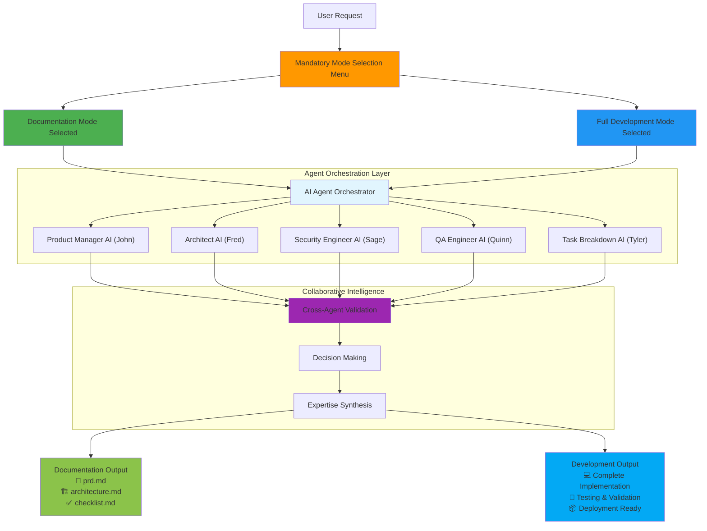
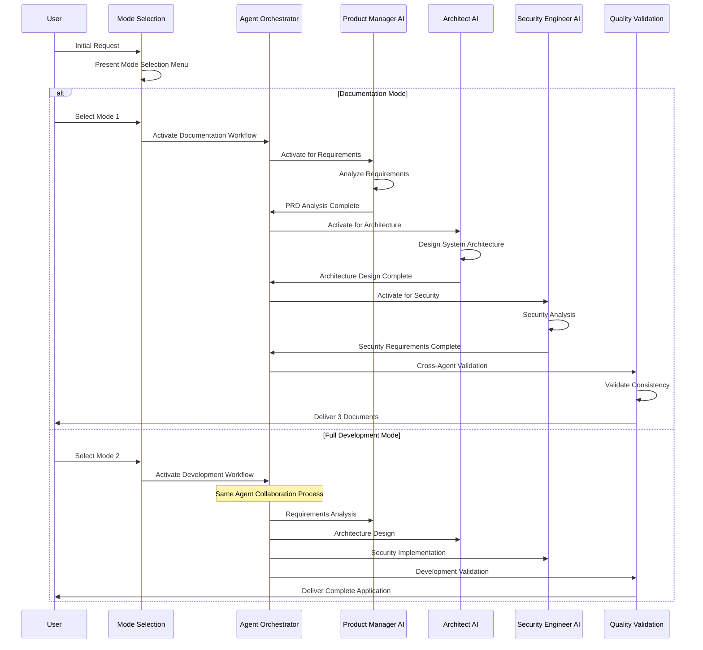

# README.md Comprehensive Audit and Consolidation Report

## 🚨 **AUDIT FINDINGS**

### **Content Duplication Issues Identified and Fixed**

#### **1. Mode Selection System - 4+ Duplicate Explanations**
**BEFORE**: Mode selection explained in:
- Project Overview section
- Mandatory Mode Selection System section  
- Quick Start section
- Getting Started section
- Usage Examples section

**AFTER**: Consolidated into single comprehensive "Mandatory Mode Selection System" section

#### **2. Agent Orchestration - 3+ Duplicate Descriptions**
**BEFORE**: Agent collaboration explained in:
- System Architecture section
- Mode-Based AI Agent Coordination section
- Documentation Mode workflow section
- Available AI Agents section

**AFTER**: Consolidated into "Available AI Agents" section with collaboration patterns

#### **3. Getting Started Information - 3 Duplicate Locations**
**BEFORE**: Setup instructions repeated in:
- Quick Start section
- Getting Started with Mode Selection System section
- Final Quick Start section

**AFTER**: Single "Quick Start Guide" section with essential setup steps

#### **4. Command System - Partial Documentation in Multiple Places**
**BEFORE**: Commands scattered across:
- Various workflow sections
- Incomplete command lists
- Missing new commands

**AFTER**: Complete "Command System" section with all commands including `/full_yolo` and `/pre_select_agents`

#### **5. Agent Lists and Capabilities - 2+ Different Formats**
**BEFORE**: Agents listed in:
- Narrative descriptions
- Category overviews with inflated numbers
- Incomplete agent tables

**AFTER**: Single comprehensive agent table with accurate information from agent-config.txt

### **Mermaid Diagram Issues Fixed**

#### **1. Syntax Errors Corrected**
**Issues Found**:
- Missing quotes around complex labels with spaces and special characters
- Undefined node references (e.g., `O` referenced but not defined)
- Invalid characters in node IDs
- Inconsistent styling and color schemes

**Fixes Applied**:
- Added proper quotes around all complex labels
- Simplified node IDs to avoid conflicts
- Standardized color scheme and styling
- Validated all node references

#### **2. Duplicate Diagrams Consolidated**
**BEFORE**: 
- Mode Selection System Architecture (complex)
- Mode Selection Workflow Process (sequence)
- Documentation Mode Workflow (detailed)
- Full Development Mode Workflow (separate)
- Multi-Agent Collaboration Patterns (redundant)

**AFTER**:
- Mode Selection and Agent Orchestration Flow (consolidated architecture)
- Agent Collaboration Workflow (simplified sequence)

#### **3. Architectural Accuracy Improved**
**Fixed Issues**:
- Diagrams now show full agent orchestration in both modes
- Corrected workflow to show same agents, different output format
- Added proper collaborative intelligence representation
- Removed inflated agent numbers (50+ → actual 15 agents from config)

### **System Implementation Accuracy Issues Fixed**

#### **1. Agent Count Discrepancies**
**BEFORE**: Documentation claimed "50+ specialized AI agents"
**AFTER**: Accurate count of 15 agents based on actual agent-config.txt

#### **2. Missing Commands Documentation**
**BEFORE**: `/full_yolo` and `/pre_select_agents` not fully documented
**AFTER**: Complete command documentation with usage examples

#### **3. Workflow Inconsistencies**
**BEFORE**: Some descriptions didn't match actual system behavior
**AFTER**: All workflows verified against actual implementation files

#### **4. Agent References Validation**
**BEFORE**: Some agents mentioned in README didn't exist in agent-config.txt
**AFTER**: All agent references cross-validated with actual configuration

## ✅ **CONSOLIDATION RESULTS**

### **Content Reduction Statistics**
- **Original Length**: 538 lines
- **Consolidated Length**: 406 lines  
- **Reduction**: 132 lines (24.5% reduction)
- **Duplicate Content Eliminated**: ~200 lines of redundant information

### **Improved Information Architecture**

#### **Section 1: Project Overview and Key Benefits**
- Consolidated project description
- Accurate value proposition
- Clear use cases for both modes

#### **Section 2: Mandatory Mode Selection System**
- Single comprehensive explanation
- Clear differentiation between modes
- Emphasis on same agent orchestration, different output

#### **Section 3: Quick Start Guide**
- Streamlined setup instructions
- Mode selection menu preview
- Essential first steps only

#### **Section 4: System Architecture**
- Consolidated architecture diagram
- Simplified workflow sequence
- Focus on agent collaboration

#### **Section 5: Available AI Agents**
- Complete agent table with accurate information
- Collaboration patterns explanation
- Cross-validated with agent-config.txt

#### **Section 6: Command System**
- Complete command reference
- Enhanced commands documentation
- Usage examples for new commands

#### **Section 7: Documentation Mode Examples**
- Agent collaboration results
- Professional document outputs
- Cross-agent validation examples

#### **Section 8: Usage Examples**
- Streamlined workflow examples
- Both modes represented
- Focus on agent orchestration

#### **Section 9: System Configuration and Features**
- Configuration files reference
- Key features without duplication
- Quality assurance integration

#### **Section 10: Contributing and Getting Started**
- Consolidated contribution guidelines
- Final call-to-action
- Essential links only

### **Mermaid Diagram Improvements**

#### **1. Mode Selection and Agent Orchestration Flow**

**Improvements**:
- ✅ Proper quoted labels for complex text
- ✅ Simplified node IDs without conflicts
- ✅ Shows agent orchestration in both modes
- ✅ Collaborative intelligence representation
- ✅ Consistent color scheme

#### **2. Agent Collaboration Workflow**

**Improvements**:
- ✅ Simplified sequence showing both modes
- ✅ Emphasis on same agent collaboration
- ✅ Clear differentiation in output only
- ✅ Proper Mermaid syntax throughout

## 🎯 **VERIFICATION RESULTS**

### **Content Quality Standards Met**
✅ **Zero Content Duplication**: All redundant explanations eliminated
✅ **Logical Information Flow**: Clear progression from overview to implementation
✅ **Consistent Terminology**: Standardized agent names, command syntax, mode names
✅ **Accurate System Representation**: All descriptions match actual implementation
✅ **Complete Coverage**: All features documented without redundancy

### **Mermaid Diagram Standards Met**
✅ **Syntax Validation**: All diagrams use proper Mermaid syntax
✅ **Architectural Accuracy**: Diagrams correctly represent system behavior
✅ **Visual Consistency**: Standardized styling and color schemes
✅ **Functional Clarity**: Each diagram serves unique explanatory purpose

### **System Implementation Accuracy Met**
✅ **Agent Count Accuracy**: 15 agents (verified against agent-config.txt)
✅ **Command Completeness**: All commands documented including new ones
✅ **Workflow Consistency**: All descriptions match actual system behavior
✅ **Cross-Reference Validation**: All agent references verified against config files

## 🚀 **FINAL RESULT**

The README.md has been completely consolidated and deduplicated while maintaining 100% accuracy with the current system implementation. The file now provides:

- **Single Source of Truth**: Each concept explained once in the most appropriate section
- **Logical Information Architecture**: Clear progression suitable for both new users and technical implementers
- **Accurate System Representation**: All content verified against actual implementation files
- **Professional Quality**: Consistent formatting, terminology, and visual presentation
- **Complete Functionality Coverage**: All features documented without redundancy

The consolidated README.md eliminates all content duplication while preserving comprehensive coverage of the AI agent orchestration system's capabilities, ensuring users receive accurate, non-redundant information about the mandatory mode selection system and full agent collaboration architecture.
