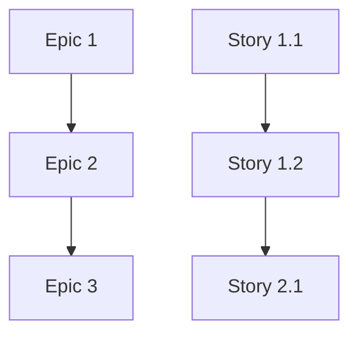

# Comprehensive Task Breakdown Document

## Project Overview

**Project Name:** {Project Name}
**Version:** {Version}
**Last Updated:** {Date}
**Document Status:** {Draft | Review | Approved}

### Executive Summary

{Brief overview of the project scope, objectives, and key deliverables}

### Key Metrics

- **Total Epics:** {Number}
- **Total User Stories:** {Number}
- **Total Tasks:** {Number}
- **Estimated Effort:** {Total Hours/Days}
- **Critical Path Duration:** {Timeline}
- **AI Agents Required:** {Number and Types}

## Epic Breakdown

### Epic 1: {Epic Name}

**Objective:** {Clear statement of epic goal}
**Priority:** {High | Medium | Low}
**Estimated Effort:** {Hours/Days}
**Dependencies:** {List of prerequisite epics or external dependencies}

**Epic Acceptance Criteria:**
1. {Criterion 1}
2. {Criterion 2}
3. {Criterion 3}

**User Stories in this Epic:**
- Story 1.1: {Story Title}
- Story 1.2: {Story Title}
- Story 1.3: {Story Title}

### Epic 2: {Epic Name}

{Repeat structure for each epic}

## Detailed User Stories

### Story 1.1: {Story Title}

**Epic:** {Epic Name}
**Priority:** {High | Medium | Low}
**Estimated Effort:** {Hours}
**Dependencies:** {Prerequisites}
**AI Agent Type:** {Recommended agent specialization}

**User Story:**
As a {user type},
I want {action},
so that {benefit}.

**Acceptance Criteria:**
1. {Specific, testable criterion}
2. {Specific, testable criterion}
3. {Specific, testable criterion}

**Technical Context:**
{Brief technical guidance and implementation notes}

**Definition of Done:**
- [ ] {Completion requirement 1}
- [ ] {Completion requirement 2}
- [ ] {Completion requirement 3}
- [ ] Code reviewed and approved
- [ ] Tests written and passing
- [ ] Documentation updated

### Story 1.2: {Story Title}

{Repeat structure for each user story}

## Frontend Development Tasks

### UI Component Development

**Epic:** {Epic Name}
**Stories:** {Related story numbers}
**Estimated Effort:** {Hours}
**AI Agent Type:** Frontend Developer

#### Task F1.1: {Component Name} Creation

**Description:** {Detailed task description}
**Acceptance Criteria:**
- {Specific requirement 1}
- {Specific requirement 2}

**Implementation Details:**
- {Technical specification 1}
- {Technical specification 2}

**Dependencies:** {Prerequisites}
**Effort Estimate:** {Hours}

#### Task F1.2: {Component Name} Styling

{Repeat structure for each frontend task}

### State Management Implementation

{Group related frontend tasks}

### API Integration

{Group related integration tasks}

## Backend Development Tasks

### API Development

**Epic:** {Epic Name}
**Stories:** {Related story numbers}
**Estimated Effort:** {Hours}
**AI Agent Type:** Backend Developer

#### Task B1.1: {API Endpoint} Implementation

**Description:** {Detailed task description}
**Acceptance Criteria:**
- {Specific requirement 1}
- {Specific requirement 2}

**Technical Specifications:**
- Endpoint: {HTTP method and path}
- Request format: {JSON schema or description}
- Response format: {JSON schema or description}
- Authentication: {Requirements}
- Validation: {Rules}

**Dependencies:** {Prerequisites}
**Effort Estimate:** {Hours}

#### Task B1.2: {Database Schema} Implementation

{Repeat structure for each backend task}

### Database Implementation

{Group related database tasks}

### Business Logic Development

{Group related business logic tasks}

## Integration and Testing Tasks

### Integration Tasks

#### Task I1.1: {Integration Name}

**Description:** {Integration details}
**Components:** {Systems being integrated}
**Dependencies:** {Prerequisites}
**Effort Estimate:** {Hours}

### Testing Tasks

#### Task T1.1: {Test Suite} Implementation

**Description:** {Testing scope and approach}
**Coverage Requirements:** {Percentage or specific areas}
**Test Types:** {Unit, Integration, E2E, etc.}
**Dependencies:** {Prerequisites}
**Effort Estimate:** {Hours}

## Infrastructure and Deployment Tasks

### Infrastructure Setup

#### Task D1.1: {Infrastructure Component} Setup

**Description:** {Infrastructure requirements}
**Technology:** {Specific tools and platforms}
**Configuration:** {Key settings and requirements}
**Dependencies:** {Prerequisites}
**Effort Estimate:** {Hours}

### Deployment Pipeline

#### Task D2.1: {Pipeline Stage} Implementation

{Deployment task details}

## Task Dependencies and Sequencing

### Dependency Matrix

### Critical Path Analysis

**Critical Path Tasks:**
1. {Task ID}: {Task Name} - {Duration}
2. {Task ID}: {Task Name} - {Duration}
3. {Task ID}: {Task Name} - {Duration}

**Total Critical Path Duration:** {Timeline}

### Parallel Execution Opportunities

**Parallel Track 1:**
- {Task ID}: {Task Name}
- {Task ID}: {Task Name}

**Parallel Track 2:**
- {Task ID}: {Task Name}
- {Task ID}: {Task Name}

## AI Agent Assignment Matrix

| Task Category | Recommended AI Agent | Estimated Tasks | Total Effort |
|---------------|---------------------|-----------------|--------------|
| Frontend Development | Frontend Developer AI | {Number} | {Hours} |
| Backend Development | Backend Developer AI | {Number} | {Hours} |
| Database Implementation | Database Specialist AI | {Number} | {Hours} |
| Testing | QA Engineer AI | {Number} | {Hours} |
| DevOps/Infrastructure | Platform Engineer AI | {Number} | {Hours} |

## Risk Assessment and Mitigation

### High-Risk Tasks

#### Risk 1: {Risk Description}
**Impact:** {High | Medium | Low}
**Probability:** {High | Medium | Low}
**Mitigation:** {Strategy}
**Contingency:** {Backup plan}

### Critical Dependencies

#### Dependency 1: {External Dependency}
**Description:** {Details}
**Risk Level:** {High | Medium | Low}
**Mitigation:** {Strategy}

## Quality Gates and Validation

### Epic-Level Gates
- [ ] {Epic completion criterion}
- [ ] {Integration validation}
- [ ] {Performance validation}

### Story-Level Gates
- [ ] {Story completion criterion}
- [ ] {Acceptance criteria validation}
- [ ] {Code quality validation}

### Task-Level Gates
- [ ] {Task completion criterion}
- [ ] {Unit test validation}
- [ ] {Code review completion}

## Effort Summary and Timeline

### By Epic
| Epic | Stories | Tasks | Effort (Hours) | Duration (Days) |
|------|---------|-------|----------------|-----------------|
| Epic 1 | {Number} | {Number} | {Hours} | {Days} |
| Epic 2 | {Number} | {Number} | {Hours} | {Days} |
| **Total** | {Number} | {Number} | {Hours} | {Days} |

### By AI Agent Type
| AI Agent Type | Tasks | Effort (Hours) | Utilization |
|---------------|-------|----------------|-------------|
| Frontend Developer | {Number} | {Hours} | {Percentage} |
| Backend Developer | {Number} | {Hours} | {Percentage} |
| **Total** | {Number} | {Hours} | 100% |

## Maintenance and Updates

### Document Versioning
- Version control approach for task breakdown updates
- Change approval process
- Impact assessment for task modifications

### Continuous Refinement
- Regular review schedule for task breakdown accuracy
- Feedback incorporation from AI agent execution
- Lessons learned integration process

---

**Document Prepared By:** Task Breakdown Specialist AI Agent
**Review Required By:** Product Owner, Technical Architect
**Next Review Date:** {Date}
